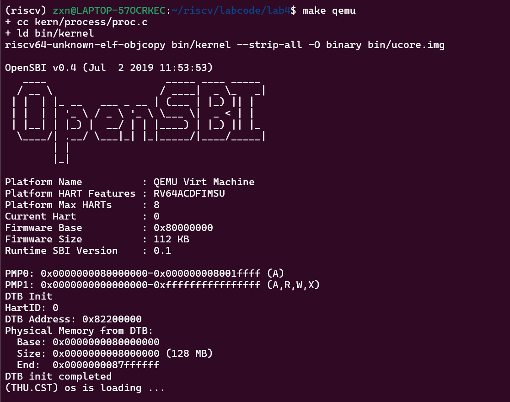
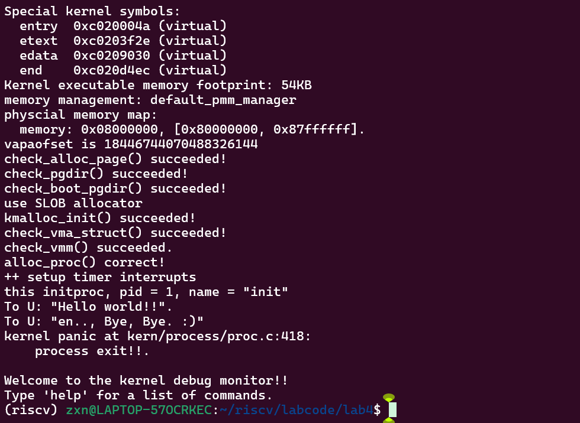
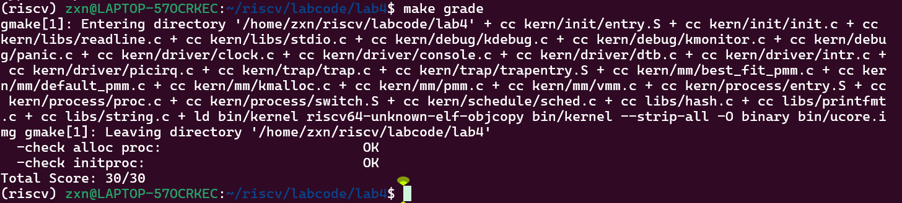

# lab 4
小组成员：朱欣宁（2313686） 宁宇嫣（2313123） 雷雨彦（2313894）


## 练习1：分配并初始化一个进程控制块

### 1. 代码实现

```c
// alloc_proc - alloc a proc_struct and init all fields of proc_struct
static struct proc_struct *
alloc_proc(void)
{
    struct proc_struct *proc = kmalloc(sizeof(struct proc_struct));
    if (proc != NULL)
    {
        /*
         * 初始化策略：
         *  1. 先把整个结构体清零，保证大多数字段为 0/NULL（包括 name 的前 PROC_NAME_LEN 字节）。
         *  2. 按照 proc_init() 内部检测的期望值，设置特定初始值：
         *       - state = PROC_UNINIT
         *       - pid = -1
         *       - pgdir = boot_pgdir_pa
         *       - tf = NULL
         *       - context 清零
         *       - runs, kstack, flags 等为 0
         *  3. 初始化用于链表的字段（list_link/hash_link），防止后续 list 操作出错。
         */
        memset(proc, 0, sizeof(struct proc_struct));

        proc->state = PROC_UNINIT;
        proc->pid = -1;
        proc->runs = 0;
        proc->kstack = 0;
        proc->need_resched = 0;
        proc->parent = NULL;
        proc->mm = NULL;

        /* context 清零（用于后续 switch_to 使用） */
        memset(&proc->context, 0, sizeof(struct context));

        /* 初始时没有 trapframe（只有在 copy_thread 时才会设置 proc->tf）*/
        proc->tf = NULL;

        /* 初始页目录 (idle/proc_init 期望等于 boot_pgdir_pa) */
        proc->pgdir = boot_pgdir_pa;

        proc->flags = 0;

        /* 进程名清零（proc_init 会检查 name 是否为 0） */
        memset(proc->name, 0, PROC_NAME_LEN + 1);

        /* 初始化链表节点，安全起见初始化常用链表成员 */
        list_init(&proc->list_link);
        list_init(&proc->hash_link);

        /* 其他字段由 memset(0) 已经置为 NULL/0 */
    }
    return proc;
}
```
> 注：此实现与 `proc_init()` 中的自检条件匹配（例如 `pgdir == boot_pgdir_pa`, `tf == NULL`, `context` 清零、`state == PROC_UNINIT`, `pid == -1` 等），能通过 `proc_init()` 的 `alloc_proc()` 正确性检查。

---

### 2. 实现说明

1. **整体清零**：对 `proc_struct` 使用 `memset(..., 0, sizeof(...))`，将绝大多数字段置为 0/NULL，减少遗漏初始化导致的问题。  

2. **显式设定关键字段**：
   - `state = PROC_UNINIT`：标记尚未完成初始化；  
   - `pid = -1`：未分配 pid 的占位值；  
   - `pgdir = boot_pgdir_pa`：与 `proc_init()` 的期望一致，表示默认页目录基址；  
   - `tf = NULL`：初始没有 trapframe（由 `copy_thread` 在创建时设置）；  
   - `context` 清零：保证 `ra/sp` 等寄存器复位，后续由 `copy_thread` 填充。  

3. **链表节点初始化**：调用 `list_init` 初始化 `list_link` 和 `hash_link`，确保随后加入进程列表安全无误。  

4. **理由**：这种“先清零、后显式设置关键字段”的策略既简单又稳健，能通过内核自检并减少后续出错风险。

---

### 3. `struct context` 与 `struct trapframe *tf` 的含义与在本实验中的作用

#### `struct context context`
- **含义**：保存内核态上下文切换时需要恢复/保存的寄存器（通常包含返回地址 `ra`、堆栈指针 `sp` 等）。  
- **作用**：
  - 用于内核调度（`switch_to`）时保存和恢复寄存器，以完成进程间上下文切换。  
  - 在 `copy_thread` 中设置 `context.ra = forkret`、`context.sp = proc->tf`，使新进程在被调度运行时跳到 `forkret` 路径继续执行。  

#### `struct trapframe *tf`
- **含义**：保存一次陷入（trap/中断/系统调用）时的完整 CPU 寄存器快照。通常放在进程的内核栈顶。  
- **作用**：
  - 保存用户态寄存器和返回用户态时要恢复的寄存器值。  
  - `copy_thread` 将传入的临时 `tf` 复制到 `proc->tf`，并设置 `proc->tf->gpr.a0 = 0`（让子进程 fork 返回 0）。  
  - `proc->tf` 配合 `context`（`context.sp` 指向 `proc->tf`）完成 fork 后从内核返回用户态的流程。

---

### 4. 小结
- 提供的 `alloc_proc` 实现保证了内核期望的初始状态（可通过 `proc_init()` 中的自检看到 `alloc_proc() correct!`）。  
- `context` 与 `tf` 分别负责内核态的上下文切换与保存陷入时的 CPU 寄存器快照，二者配合实现 fork/调度/返回用户态的流程。

---


## 练习二
我们需要完成在kern/process/proc.c中的do_fork函数中的处理过程。do_fork的作用是，创建当前内核线程的一个副本，它们的执行上下文、代码、数据都一样，但是存储位置不同，因此我们实际需要"fork"的东西是stack和trapframe。

### 1. 设计实现过程
* 按照题目要求，先要**调用alloc_proc**，为新的进程分配一块特定大小的内存，初始化进程状态和进程的各种字段，如PID、上下文、内存管理等，然后为进程分配一个内核栈：
```C
if ((proc = alloc_proc()) == NULL) {
    goto fork_out;
}

if (setup_kstack(proc) != 0) {
    goto bad_fork_cleanup_proc;
}
```
* 然后是两个**复制操作**，复制原进程的内存管理信息到新进程、复制原进程上下文到新进程：
```C
if (copy_mm(clone_flags, proc) != 0) {
    goto bad_fork_cleanup_kstack;
}

copy_thread(proc, stack, tf);
```
* 关闭中断保护，**将新进程加入哈希表和进程列表**，为进程分配唯一PID，将进程加入PID哈希表、全局进程列表，而后恢复之前的中断状态，允许系统继续响应中断。关中断保护这一操作可以防止在进程注册过程中被中断打断导致数据不一致：
```C
bool intr_flag;
local_intr_save(intr_flag);
{
    proc->pid = get_pid();
    hash_proc(proc);
    list_add(&proc_list, &(proc->list_link));
    nr_process++;
}
local_intr_restore(intr_flag);
```

* 最后**唤醒新进程并返回新进程的PID**：
```C
wakeup_proc(proc);

ret = proc->pid;
```
### 2. ucore是否做到给每个新fork的线程一个唯一的id？
**是的。**

我们回到get_pid函数来看，这个函数维护了last_pid和next_safe两个变量来跟踪可用的PID范围。它的大概逻辑是：last_pid是当前要尝试分配的PID，next_safe标识当前安全范围的上界，当last_pid递增到MAX_PID时会回绕到1重新开始，确保PID在有效范围内循环使用。在分配过程中函数会遍历整个进程列表，检查当前last_pid是否已被占用，如果发现冲突就将last_pid加1并重新扫描，同时比较现有进程的PID调整next_safe，将其设置为大于last_pid的最小已用PID从而确定下一个安全边界。

这种机制，加上在do_fork函数中关中断保护的操作，即在分配PID和将进程加入列表的整个过程中禁止中断，两者有效防止了并发场景下的竞争条件，确保了即使在多核环境下也不会出现PID重复分配的情况，因此ucore能够为每个新创建的线程分配全局唯一的进程标识符。

## 练习三

### 1. 编写proc_run函数
代码实现：
```cpp
void proc_run(struct proc_struct *proc)
{
    if (proc != current)  // 判断需要运行的进程时是否已经在运行了
    {
         bool intr_flag;
         struct proc_struct *prev = current, *next = proc;
         local_intr_save(intr_flag); // 关闭中断
         {
             current = proc; // 将当前进程换为 要切换到的进程
             // 设置任务状态段 tss 中的特权级 0 下的 esp0 指针为 next 内核线程 的内核栈的栈顶
             local_intr_restore(next->kstack + KSTACKSIZE); // 设置 TSS
             lsatp(next->pgdir); 
             switch_to(&(prev->context), &(next->context)); // 调用 switch_to 进行上下文的保存与切换，切换到新的线程
         }
         local_intr_restore(intr_flag);
    }
}

```
### 问题
问题：在本实验的执行过程中，创建且运行了几个内核线程？

总共创建了**两个内核线程**，分别为：

**idleproc**，为第 0 个内核线程，在完成新的内核线程的创建以及各种初始化工作之后，进入死循环，用于调度其他进程或线程；

**initproc**，被创建用于打印 "Hello World" 的线程。本次实验的内核线程，只用来打印字符串。

**执行流程**：

系统启动 → 调用 proc_init()

创建 idleproc → 设置为当前线程 current = idleproc

创建 initproc → 通过 kernel_thread() 和 do_fork() 创建

线程调度 → idleproc 运行，检查到 need_resched = 1 时调用 schedule()

切换执行 → 调度器选择 initproc 运行，执行 init_main 函数

## 编译运行

以下是编译并执行```make qemu```的结果：





根据以上编译结果可看出，编译和运行过程顺利完成，主要表现如下：

系统成功加载并初始化了物理内存管理，完成了页目录检查等关键操作，内存分配器工作正常。进程管理模块正确初始化，alloc_proc()函数通过验证，创建了PID为1的init内核线程。该线程成功执行并输出了"Hello world!!"和"en... Bye, Bye. :)"信息，证明进程创建和调度功能正常运行。最后当init进程退出时，系统按预期触发了内核恐慌并进入调试监控状态，这符合实验设计的流程，表明整个内核线程的生命周期管理功能完整实现。

以下是编译并执行```make grade```的结果：



根据输出结果分析，编译和测试过程顺利完成，所有检查项均通过。系统成功构建了内核镜像，在进程管理相关的测试中，"check alloc proc"和"check initproc"两项关键测试均显示OK，表明进程控制块分配和初始化进程创建功能正确实现。最终得分为30/30，获得满分，这证明实验四中进程管理机制的设计与实现完全符合要求，所有功能模块工作正常。


## 扩展练习1：
问题：说明语句local_intr_save(intr_flag);....local_intr_restore(intr_flag);是如何实现开关中断的？

**工作原理**如下：

**保存状态**：local_intr_save 会读取当前的sstatus寄存器，检查SIE位，保存中断使能状态到intr_flag变量中，然后关闭中断

**进入临界区**：在中断关闭的状态下执行需要原子性的操作，防止被中断打断

**恢复状态**：local_intr_restore 根据之前保存的intr_flag值，恢复中断到原来的状态（而不是简单地开启中断）


## 扩展练习2:
问题：深入理解不同分页模式及 get_pte() 设计分析。

### 1. 为什么 `get_pte()` 中会出现两段高度相似的代码？
在本次实验的 `RISC-V` 分页机制中，使用的是 `SV39 `三层页表结构（也兼容 SV48 四层、SV32 二层）。不同分页模式的差异主要体现在：
| 模式 | 层数       | VA 位数 | 说明                  |
| ---- | ---------- | ------- | --------------------- |
| SV32 | 2 层 (L1 + L0) | 32 位   | 类似 x86 传统两级页表 |
| SV39 | 3 层 (L2 + L1 + L0) | 39 位   | uCore 当前使用模式    |
| SV48 | 4 层 (L3 + L2 + L1 + L0) | 48 位   | 更深层级，结构保持一致 |

一个关键点是：
**无论页表层数多少，RISC-V 采用的都是“每一级页表结构完全一致”的树形结构。**

每一级页表都由 512 项（9-bit index）组成，查找方式完全一致：
1. 取 VA 的某一段索引
2. 找对应 `PDE / PTE`
3. 若不存在且需要 create → 分配新页表
4. 进入下一层

**`get_pte()` 中的两段相似代码**

在 uCore 的` get_pte() `中（SV39 3 层页表），代码如下:
```c
pde_t *pdep1 = &pgdir[PDX1(la)];
if (!(*pdep1 & PTE_V)) {
    struct Page *page;
    if (!create || (page = alloc_page()) == NULL)
        return NULL;
    set_page_ref(page, 1);
    uintptr_t pa = page2pa(page);
    memset(KADDR(pa), 0, PGSIZE);
    *pdep1 = pte_create(page2ppn(page), PTE_U | PTE_V);
}

pde_t *pdep0 = &((pte_t *)KADDR(PDE_ADDR(*pdep1)))[PDX0(la)];
if (!(*pdep0 & PTE_V)) {
    struct Page *page;
    if (!create || (page = alloc_page()) == NULL)
        return NULL;
    set_page_ref(page, 1);
    uintptr_t pa = page2pa(page);
    memset(KADDR(pa), 0, PGSIZE);
    *pdep0 = pte_create(page2ppn(page), PTE_U | PTE_V);
}
```
这两段代码完全相似，分别对应：
- 第1段：L2 → L1目录项
- 第2段：L1 → L0目录项

**为什么结构几乎一模一样？**

因为无论 `SV32 / SV39 / SV48`：
- 每一级页表的格式相同
- 每一级的访问方式完全一致
- 每一级都可能需要在缺失时分配新的页表页

`SV39` 是三级结构，因此需要两次“下探”：
```nginx
L2 → L1 
L1 → L0 → PTE
```
`SV48`则会多一级：
```nginx
L3 → L2 → L1 → L0
```
`SV32` 则只有一级：
```nginx
L1 → L0
```
因此，只要不是单层页表，每下降一层，都重复同样的逻辑：
- 判断是否存在下一层页表
- 若不存在而 create=1 → 分配新页表
- 初始化、设置 PTE_V
- 进入下一层目录

所以出现了两段几乎一模一样的代码。

这体现了 RISC-V 页表结构的 **统一性与递归性**、以及 uCore 实现中未使用通用“循环/递归”封装的结果。

---

### 2. `get_pte()` 是否应该拆分为“查找页表项”和“分配页表项”两个独立函数？

**目前 get_pte() 的问题**

当前 `get_pte(pgdir, la, create) `同时包含：
- 查找路径
- 必要时创建页表（create=1）
- 返回对应 PTE 的虚拟地址

这种写法有优点也有缺点：

**优点**：
- 简化了上层 `page_insert / boot_map_segment` 的操作

  只需调用 `get_pte(create=1)`就能保证路径存在
- 一次函数遍历即可完成查找+创建，避免重复代码

**缺点**：
- **违反了单一职责原则（SRP）**

  查找和创建逻辑混在一起，降低可读性与可维护性
- **难以扩展到 SV48**

  如果支持更多层，代码会重复更多段
- **调试困难**

  有时只想“查”，却不得不小心处理 create 参数

**建议：可以拆分为两个函数**

1. **pte_t walk_page_table(pgdir, la, level)**

   纯查找，不会分配内存
2. **pte_t ensure_pte(pgdir, la)**

   保证路径存在，缺页表就创建

这样：
- 层数变化时更容易扩展,可通过循环实现
- 查找和创建逻辑更清晰
- 符合内核常见设计,Linux 就使用 walk_page_range / alloc_pte 等分层函数

#### 代码建议修改
**纯查找函数: `walk_page_table`**

仅负责查找页表项，不创建新页表。

```c
pte_t *walk_page_table(pde_t *pgdir, uintptr_t la) {
    pde_t *pdep1 = &pgdir[PDX1(la)];
    if (!(*pdep1 & PTE_V)) {
        return NULL;
    }
    pde_t *pdep0 = &((pte_t *)KADDR(PDE_ADDR(*pdep1)))[PDX0(la)];
    if (!(*pdep0 & PTE_V)) {
        return NULL;
    }
    return &((pte_t *)KADDR(PDE_ADDR(*pdep0)))[PTX(la)];
}
```
**确保路径存在函数 `ensure_pte`**

负责在页表缺失时创建新页表，确保路径存在。

```c
pte_t *ensure_pte(pde_t *pgdir, uintptr_t la) {
    pde_t *pdep1 = &pgdir[PDX1(la)];
    if (!(*pdep1 & PTE_V)) {
        struct Page *page = alloc_page();
        if (page == NULL) {
            return NULL;
        }
        set_page_ref(page, 1);
        uintptr_t pa = page2pa(page);
        memset(KADDR(pa), 0, PGSIZE);
        *pdep1 = pte_create(page2ppn(page), PTE_U | PTE_V);
    }
    pde_t *pdep0 = &((pte_t *)KADDR(PDE_ADDR(*pdep1)))[PDX0(la)];
    if (!(*pdep0 & PTE_V)) {
        struct Page *page = alloc_page();
        if (page == NULL) {
            return NULL;
        }
        set_page_ref(page, 1);
        uintptr_t pa = page2pa(page);
        memset(KADDR(pa), 0, PGSIZE);
        *pdep0 = pte_create(page2ppn(page), PTE_U | PTE_V);
    }
    return &((pte_t *)KADDR(PDE_ADDR(*pdep0)))[PTX(la)];
}
```


### 3. 总结
- `get_pte() `中两段几乎相同的代码源于 `RISC-V` 多级页表结构的**递归性与统一性** —— 每一级页表格式和处理方式完全一致，因此进入下一层目录时必须重复同样的逻辑。
- 在` SV32/SV39/SV48 `中，唯一区别是页表层数不同，但每层操作完全一致。这也解释了代码的相似性。
- 当前 `get_pte()` 将“查找页表项”和“必要时创建页表项”放在一个函数中，虽然简化了使用、提高了效率，但违反**单一职责原则**，并增加了维护负担。
- 分离为 `walk_page_table`（仅查找）和`ensure_pte`（负责创建）的双函数结构更合理，可读性、可扩展性更强，也与 Linux 内核的设计更一致。


## 实验中与操作系统原理对应的知识点

### 1.进程控制块（PCB）
- **OS原理**：进程生活在虚拟地址空间中，CPU上发出的地址都是虚拟的，需要经MMU查询转化后得到物理地址。每个进程有自己的页表，以管理独立的地址空间，在创建新的进程时，Linux中使用fork函数实现进程空间的（半）浅拷贝。
- **相关实验内容**：在**alloc_proc**函数中初始化进程控制块时，需要将进程状态设置为未初始化状态，表明该进程控制块尚未投入使用；将进程标识符设置为无效值，表示尚未分配有效PID；将页表基址寄存器设置为内核全局页目录地址，确保所有内核线程共享统一的内核地址空间；同时将内核栈指针初始化为空，表示尚未为进程分配独立的内核栈空间。
- **关系与差异**：原理强调每个进程有独立的地址空间和页表，实验中内核线程共享内核地址空间，与用户进程有所不同。

### 2.进程上下文（Context）
- **OS原理**：OS记录一个进程的执行状态所需的数据：上下文（即寄存器组，保存当前状态）、栈（用于保存函数调用的序列和局部变量）。为了保持线程执行的独立性，每个线程有自己的堆栈。
- **相关实验内容**：实验中**struct context**被用于在内核调度（switch_to）时保存和恢复寄存器，以完成进程间上下文切换。  
- **关系与差异**：原理明确指出了上下文包含的寄存器组和栈，实验中具体实现了这一概念，确保进程切换时能正确保存和恢复执行状态。

### 3.进程创建（fork机制）
- **OS原理**：写时复制(copy-on-write, COW)的方法节省新进程的创建时间，而新的进程一般会调用exec，按照可执行文件头部的信息重建自己的虚拟地址空间布局图。
- **相关实验内容**：实验中**do_fork函数**中，完成了分配进程控制块、设置父进程、分配内核栈、复制原进程内存管理信息、复制陷阱帧和上下文的相关操作。
- **关系与差异**：原理强调写时复制优化，但实验中内核线程不涉及用户空间内存复制，简化了实现。

### 4.进程ID管理
- **OS原理**：PPT 4.4中的**openEuler中的进程树示意**展示了进程间的层次关系，这需要唯一的进程标识符来维护。
- **相关实验内容**：do_fork函数中，调用了函数get_pid()，函数get_pid()中包含了保证PID唯一的算法，每次都会重新计算PID范围。
- **关系与差异**：课堂中通过进程树说明了了PID的唯一性要求，而实验中通过具体的PID分配算法确保唯一性。

### 5.内核栈分配
- **OS原理**：为什么线程要有自己的栈区呢？为了保持线程执行的独立性，每个线程有自己的堆栈，而线程的私有项包括栈指针和局部变量。
- **相关实验内容**：在setup_kstack函数中，分配2个页的内核栈空间。
- **关系与差异**：原理强调了栈独立性的重要性，而实验中为每个线程分配独立的内核栈空间来保证执行独立性。

### 6.中断控制
- **OS原理**：中断、异常和系统调用是用户程序与内核交互的三种机制，都能自动提升CPU权限到ring0内核态。中断由外部设备异步触发，异常由指令错误同步引发，系统调用由程序主动发起。关键机制在于中断响应时硬件自动提权，中断返回时软件负责降权。
- **相关实验内容**：在进程切换函数proc_run中，使用local_intr_save和local_intr_restore宏保护临界区。前者通过清除SSTATUS寄存器的SIE位禁用中断，后者恢复原有中断状态。这确保了进程切换过程中修改current指针、切换页表和上下文切换等操作的原子性，防止被中断打断导致状态不一致。
- **关系与差异**：实验通过直接操作控制寄存器实现了原理描述的权限控制机制，但进行了简化，重点实现了原理中的"保护临界区"思想，通过开关中断确保进程切换的安全性和数据一致性。

### 7.分页机制
- **OS原理**：多级页表的核心机制是每个进程拥有独立的页表，通过MMU将虚拟地址转换为物理地址；系统采用多级页表结构（如RISCV的SV39），通过逐级查表完成地址翻译；当页表项不存在时会触发缺页异常，由操作系统负责分配物理页框并建立映射。
- **相关实验内容**：在get_pte函数中设置了PTE_V等，通过alloc_page从系统空闲链表中分配物理内存，建立完整的页表映射关系。
- **关系与差异**：原理从硬件MMU视角描述地址翻译，实验从软件视角实现页表构建，两者在页表层次结构和地址划分上完全一致，但不同之处在于实验简化了TLB管理、写时复制等复杂机制，专注于基础页表操作。

## 实验中未覆盖的操作系统原理知识点
- **1. 线程的两套实现**：用户线程切换快但不能跨核，内核线程能跨核但切换慢。实验只用了内核线程，没涉及两种模型的混合使用与权衡。
- **2. 进程间的对话方式**：信号、管道、共享内存等是进程间通信的主要手段。实验只是创建了进程，没有涉及进程之间是如何传递数据和信号的。
- **3. 内存压缩与进程查杀**：比如手机，会利用ZRAM压缩内存，用Low-Memory Killer在内存不足时智能杀掉后台进程。而实验中的内存管理很基础，没有这些高级回收策略。
- **4. 系统调用的权限升级**：用户程序通过系统调用请求内核服务时，CPU会从低权限模式切换到高权限模式。实验用了系统调用，但没讲这个关键的权限切换过程如何保障安全。


