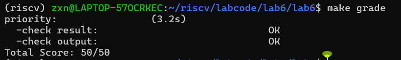
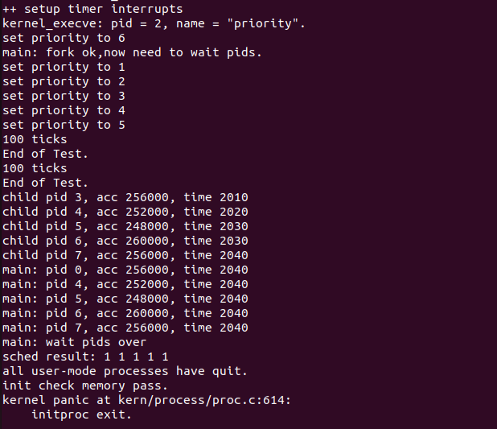
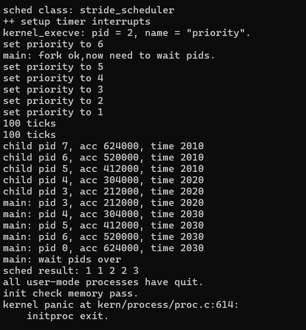

# Lab6 
## 练习一
根据你提供的代码，我来详细分析调度器框架的实现。这是典型的**策略模式**设计。

### 一、调度类结构体 `sched_class` 的分析
#### 1. 结构体定义
```c
struct sched_class {
    const char *name;                           // 调度算法名称
    void (*init)(struct run_queue *rq);         // 初始化运行队列
    void (*enqueue)(struct run_queue *rq, struct proc_struct *proc);  // 进程入队
    void (*dequeue)(struct run_queue *rq, struct proc_struct *proc);  // 进程出队
    struct proc_struct *(*pick_next)(struct run_queue *rq);           // 选择下一个进程
    void (*proc_tick)(struct run_queue *rq, struct proc_struct *proc);// 时间片处理
};
```

#### 2. 函数指针的作用和调用时机
```
|   函数指针   |           作用            |               调用时机                 |
|-------------|---------------------------|---------------------------------------|
| `init`      | 初始化运行队列数据结构      | `sched_init()` 中调用                  |
| `enqueue`   | 将就绪进程加入运行队列      | `wakeup_proc()` 和 `schedule()` 中调用 |
| `dequeue`   | 从运行队列移除进程          | `schedule()` 中选择下一个进程后调用     |
| `pick_next` | 选择下一个要运行的进程      | `schedule()` 中选择下一个进程时调用     |
| `proc_tick` | 处理时钟中断，更新进程时间片 | 时钟中断处理函数中调用                  |
```
#### 3. 为什么使用函数指针而不是直接实现函数？

**设计目的**：实现**策略模式**，将调度算法抽象为可插拔的组件。

**优势**：
1. **解耦**：调度框架与具体算法分离，框架代码不需要知道具体实现
2. **可扩展**：添加新调度算法只需实现 `sched_class` 接口
3. **运行时切换**：理论上可以在运行时切换调度算法
4. **代码复用**：所有调度算法共享相同的框架代码

### 二、运行队列结构体 `run_queue` 的分析

#### 1. lab5 和 lab6 的对比

**lab5 的运行队列**（简单）：
```c
// 只有链表，支持简单的 FIFO 调度
struct run_queue {
    list_entry_t run_list;    // 就绪进程链表
    unsigned int proc_num;    // 就绪进程数
    int max_time_slice;       // 最大时间片
};
```

**lab6 的运行队列**（扩展）：
```c
struct run_queue {
    list_entry_t run_list;          // 就绪进程链表（用于RR/FIFO）
    unsigned int proc_num;          // 就绪进程数
    int max_time_slice;             // 最大时间片
    skew_heap_entry_t *lab6_run_pool; // 斜堆（用于stride调度）
};
```

#### 2. 为什么需要两种数据结构？

**不同的调度算法需要不同的数据结构**：
- **RR（轮转调度）和 FIFO**：使用双向链表即可，操作简单
- **stride调度**：需要优先队列，斜堆提供了 O(log n) 的插入和删除操作

**设计优势**：
1. **性能优化**：不同算法使用最适合的数据结构
2. **内存效率**：运行时只使用其中一种数据结构
3. **灵活性**：可以支持更多调度算法

### 三、调度器框架函数分析

#### 1. `sched_init()` 的变化
```c
void sched_init(void) {
    list_init(&timer_list);
    
    // 关键：这里关联具体的调度类
    sched_class = &default_sched_class;  // 可替换为其他调度类
    
    rq = &__rq;
    rq->max_time_slice = MAX_TIME_SLICE;
    sched_class->init(rq);  // 调用具体调度类的初始化
    
    cprintf("sched class: %s\n", sched_class->name);
}
```
增加了调度类的初始化，框架不再直接操作数据结构。

#### 2. `wakeup_proc()` 的变化
```c
void wakeup_proc(struct proc_struct *proc) {
    // ...
    if (proc->state != PROC_RUNNABLE) {
        proc->state = PROC_RUNNABLE;
        proc->wait_state = 0;
        if (proc != current) {
            sched_class_enqueue(proc);  // 通过调度类入队
        }
    }
    // ...
}
```
不再直接操作运行队列，而是通过调度类接口。

#### 3. `schedule()` 的变化
```c
void schedule(void) {
    // ...
    if (current->state == PROC_RUNNABLE) {
        sched_class_enqueue(current);  // 当前进程重新入队
    }
    if ((next = sched_class_pick_next()) != NULL) {  // 选择下一个进程
        sched_class_dequeue(next);  // 从队列中移除
    }
    // ...
}
```
完全通过调度类接口进行调度决策。

### 四、调度器框架使用流程分析

**完整流程**：
```
内核启动 → kern_init() → sched_init()
          ↓
    sched_class = &default_sched_class
          ↓
    rq->max_time_slice = MAX_TIME_SLICE
          ↓
    sched_class->init(rq)  // 调用具体调度算法的初始化
          ↓
    打印调度算法名称
```

**`default_sched_class` 关联机制**：
- 在 `sched.c` 中声明：`static struct sched_class *sched_class;`
- 在 `sched_init()` 中赋值：`sched_class = &default_sched_class;`
- 在 `default_sched.c` 中定义具体的 `default_sched_class` 实例

**`need_resched` 标志位的作用**：

标记进程是否需要被调度，是**延迟调度**的关键机制。

**设置时机**：
1. 时间片用完（在 `proc_tick` 中设置）
2. 进程主动放弃 CPU（调用 `schedule`）
3. 进程退出时
4. 优先级更高的进程就绪时

**检查时机**：在**中断返回前**检查，确保调度只在安全点进行。

### 五、调度算法的切换机制

#### 1. 添加新调度算法（如 stride）的步骤

**步骤1**：实现新的调度类
```c
// stride_sched.c
struct sched_class stride_sched_class = {
    .name = "stride_scheduler",
    .init = stride_init,
    .enqueue = stride_enqueue,
    .dequeue = stride_dequeue,
    .pick_next = stride_pick_next,
    .proc_tick = stride_proc_tick,
};
```

**步骤2**：修改一处代码即可切换
```c
// 在 sched_init() 中修改
// sched_class = &default_sched_class;  // 原来的
sched_class = &stride_sched_class;       // 新的
```

#### 2. 为什么当前设计使切换变得容易？

**关键设计特性**：
1. **接口统一**：所有调度算法实现相同的 `sched_class` 接口
2. **数据封装**：调度算法自行管理内部数据结构
3. **依赖倒置**：框架依赖抽象接口，不依赖具体实现
4. **编译时绑定**：通过指针关联，无需修改框架代码

**对比传统设计**：
```c
// 传统硬编码设计（难以扩展）
void schedule(void) {
    if (scheduler_type == RR) {
        // RR 调度代码
    } else if (scheduler_type == STRIDE) {
        // stride 调度代码
    } else if (scheduler_type == OTHER) {
        // 其他调度代码
    }
}
// 每次添加新算法都需要修改框架代码
```


## 练习二
### 一、实验概述
#### 1.1 实验目的
- 理解操作系统调度器框架的工作原理，掌握 Lab6 调度框架与 Lab5 简单调度的核心差异。
- 基于 Lab6 调度器框架，实现时间片轮转（Round Robin, RR）调度算法，完成 `RR_init`、`RR_enqueue`、`RR_dequeue`、`RR_pick_next` 和 `RR_proc_tick` 函数的编码。
- 验证 RR 调度算法的正确性和公平性，分析其优缺点及优化方向。
- 深入思考优先级 RR 调度的实现方案及多核调度的改进思路。


### 二、Lab5 与 Lab6 关键函数差异分析
#### 2.1 对比函数：`kern/schedule/sched.c` 中的 `schedule()` 函数
##### 2.1.1 Lab5 版本实现（简化 FIFO 调度）
```c
void schedule(void) {
    bool intr_flag;
    struct proc_struct *next;
    local_intr_save(intr_flag);
    {
        current->need_resched = 0;
        // 直接从链表中选择下一个进程
        list_entry_t *le = list_next(&(current->run_link));
        if (le != &(rq->run_list)) {
            next = le2proc(le, run_link);
        } else {
            next = idleproc;
        }
        next->runs++;
        if (next != current) {
            proc_run(next);
        }
    }
    local_intr_restore(intr_flag);
}
```

##### 2.1.2 Lab6 版本实现（支持调度算法框架）
```c
void schedule(void) {
    bool intr_flag;
    struct proc_struct *next;
    local_intr_save(intr_flag);
    {
        current->need_resched = 0;
        // 使用调度类接口
        if (current->state == PROC_RUNNABLE) {
            sched_class_enqueue(current);  // 当前进程重新入队
        }
        next = sched_class_pick_next();    // 通过调度算法选择下一个进程
        if (next != NULL) {
            sched_class_dequeue(next);     // 将选中的进程出队
        }
        if (next == NULL) {
            next = idleproc;
        }
        next->runs++;
        if (next != current) {
            proc_run(next);
        }
    }
    local_intr_restore(intr_flag);
}
```

#### 2.2 改动原因分析
1. **架构扩展性提升**：Lab5 的调度逻辑硬编码在 `schedule()` 函数中，仅支持简单的 FIFO 调度，无法灵活扩展；Lab6 引入调度类框架，通过 `sched_class_enqueue`、`sched_class_pick_next` 等接口解耦调度逻辑，可无缝支持 RR、优先级、CFS 等多种调度算法。
2. **算法可替换性增强**：Lab5 若需更换调度算法，必须修改 `schedule()` 函数本身，改动成本高且易引入 bug；Lab6 中新增调度算法仅需实现对应的调度类接口，无需修改调度器主函数，符合“开闭原则”。
3. **进程状态管理规范化**：Lab5 未检查进程状态，直接从链表选取下一个进程，可能调度到 SLEEPING（睡眠）或 ZOMBIE（僵尸）状态的无效进程；Lab6 明确判断 `current->state == PROC_RUNNABLE`，仅将可运行进程重新入队，确保调度队列的有效性。

#### 2.3 不做改动的后果
- 无法实现时间片轮转：Lab5 无时间片概念，进程会一直运行直到主动放弃 CPU，无法满足 RR 算法“时间片耗尽切换”的核心需求。
- 无法支持优先级调度：Lab5 按链表顺序选取进程，无法根据进程优先级排序，无法实现高优先级进程优先执行的差异化调度。
- 系统稳定性风险：调度无效进程会导致 CPU 资源浪费，甚至引发进程状态混乱、系统崩溃等问题。

### 三、RR 调度算法函数实现思路与详解
#### 3.1 `RR_init` 函数：初始化运行队列
##### 3.1.1 实现代码
```c
static void RR_init(struct run_queue *rq)
{
    list_init(&(rq->run_list));  // 初始化运行队列链表
    rq->proc_num = 0;             // 初始化进程数为0
}
```

##### 3.1.2 设计思路
- 运行队列采用**双向循环链表**存储可运行进程，双向链表支持 O(1) 时间复杂度的头部插入和尾部删除，循环链表可简化边界判断（无需检查 `NULL`）。
- `rq->proc_num` 记录队列中进程的数量，用于调度器的负载统计、调试及后续负载均衡扩展。

##### 3.1.3 边界处理
- 初始化后队列链表为空，`rq->run_list` 的 `prev` 和 `next` 指针均指向自身，`proc_num` 为 0，确保后续 `enqueue`/`dequeue` 操作的正确性。

#### 3.2 `RR_enqueue` 函数：进程入队
##### 3.2.1 实现代码
```c
static void RR_enqueue(struct run_queue *rq, struct proc_struct *proc)
{
    assert(list_empty(&(proc->run_link)));  // ① 边界检查
    
    list_add_before(&(rq->run_list), &(proc->run_link));  // ② 尾部插入
    
    if (proc->time_slice == 0 || proc->time_slice > rq->max_time_slice) {
        proc->time_slice = rq->max_time_slice;  // ③ 时间片重置
    }
    
    proc->rq = rq;  // ④ 设置运行队列指针
    rq->proc_num++;  // ⑤ 更新计数
}
```

##### 3.2.2 关键代码解释
1. **边界检查（①）**：`assert(list_empty(&(proc->run_link)))` 确保当前进程未加入其他运行队列，防止重复入队导致链表结构破坏。若进程已在其他队列中，`assert` 会触发，便于调试定位问题。
2. **尾部插入（②）**：采用 `list_add_before(&(rq->run_list), &(proc->run_link))` 操作，在循环链表的尾部插入进程。原因：RR 算法遵循 FIFO 原则，新入队进程应排在队尾，等待前序进程执行完毕或时间片耗尽。
3. **时间片重置（③）**：
   - 场景 1：新创建的进程（`time_slice == 0`），需初始化时间片。
   - 场景 2：进程时间片耗尽后重新入队（`time_slice == 0`），重置为最大时间片。
   - 场景 3：时间片异常大于最大值（可能因数据损坏），强制重置为 `max_time_slice`，确保调度公平性。
4. **队列指针绑定（④）**：`proc->rq = rq` 让进程记录所属的运行队列，便于 `dequeue` 时验证队列合法性，也为多核调度中进程迁移提供支持。
5. **计数更新（⑤）**：`rq->proc_num++` 维护队列长度的准确性，为 `pick_next` 操作判断队列是否为空提供依据。

##### 3.2.3 链表操作选择理由
- 选择 `list_add_before` 而非 `list_add_after`：在双向循环链表中，`rq->run_list` 作为头节点，其 `prev` 指针指向队尾元素，`list_add_before(&rq->run_list, &proc->run_link)` 等价于在队尾插入，符合 RR 算法的 FIFO 逻辑。

#### 3.3 `RR_dequeue` 函数：进程出队
##### 3.3.1 实现代码
```c
static void RR_dequeue(struct run_queue *rq, struct proc_struct *proc)
{
    assert(!list_empty(&(proc->run_link)) && proc->rq == rq);  // ① 安全检查
    
    list_del_init(&(proc->run_link));  // ② 从队列删除并重置
    
    rq->proc_num--;  // ③ 更新计数
}
```

##### 3.3.2 关键代码解释
1. **安全检查（①）**：
   - `!list_empty(&(proc->run_link))`：确保进程确实在某个链表中，避免对未入队进程执行出队操作。
   - `proc->rq == rq`：确保进程出队的队列是其所属的队列，防止跨队列操作导致数据混乱。
2. **删除与重置（②）**：使用 `list_del_init` 而非 `list_del`。`list_del` 仅删除节点但不重置 `prev`/`next` 指针，可能导致悬空指针；`list_del_init` 会将节点的 `prev` 和 `next` 设为 `NULL`，确保后续 `list_empty` 检查能正确判断进程是否在队列中。
3. **计数更新（③）**：`rq->proc_num--` 保持队列长度与实际进程数一致，避免因计数错误导致调度逻辑异常。

##### 3.3.3 边界处理
- 若队列中仅剩余一个进程，出队后 `rq->proc_num` 变为 0，`rq->run_list` 恢复为初始化状态（`prev` 和 `next` 指向自身），确保后续入队操作正常。

#### 3.4 `RR_pick_next` 函数：选择下一个执行进程
##### 3.4.1 实现代码
```c
static struct proc_struct *RR_pick_next(struct run_queue *rq)
{
    list_entry_t *le = list_next(&(rq->run_list));  // ① 获取队首
    
    if (le != &(rq->run_list)) {  // ② 判断队列非空
        return le2proc(le, run_link);  // ③ 转换为进程指针
    }
    
    return NULL;  // ④ 队列为空
}
```

##### 3.4.2 关键代码解释
1. **获取队首（①）**：`list_next(&(rq->run_list))` 获取循环链表的头节点（`rq->run_list`）的下一个节点，即队首进程。因为 RR 算法按 FIFO 顺序调度，每次选择队首进程执行。
2. **队列非空判断（②）**：若 `le != &(rq->run_list)`，说明队列中有进程（循环链表为空时，`rq->run_list` 的 `next` 指向自身）；反之则队列为空。
3. **进程指针转换（③）**：使用 `le2proc` 宏将链表节点指针转换为 `proc_struct` 指针。该宏基于结构体成员偏移量计算基地址，定义如下：
   ```c
   #define le2proc(le, member) to_struct((le), struct proc_struct, member)
   ```
4. **返回空（④）**：队列为空时返回 `NULL`，此时调度器会选择 `idleproc`（空闲进程）执行，避免 CPU 空转。

##### 3.4.3 边界处理
- 队列为空时返回 `NULL`，由 `schedule()` 函数兜底选择空闲进程，确保系统正常运行。

#### 3.5 `RR_proc_tick` 函数：时间片管理与调度触发
##### 3.5.1 实现代码
```c
static void RR_proc_tick(struct run_queue *rq, struct proc_struct *proc)
{
    if (proc->time_slice > 0) {
        proc->time_slice--;  // ① 时间片递减
    }
    
    if (proc->time_slice == 0) {
        proc->need_resched = 1;  // ② 设置调度标志
    }
}
```

##### 3.5.2 关键代码解释
1. **时间片递减（①）**：每次时钟中断（约 10ms）触发时，当前运行进程的时间片减 1。先判断 `proc->time_slice > 0`，避免时间片下溢（出现负数）。
2. **调度标志设置（②）**：当时间片耗尽（`time_slice == 0`）时，设置 `proc->need_resched = 1`，通知系统需要重新调度。

##### 3.5.3 为什么不直接调用 `schedule()`？
- 中断上下文安全性：`RR_proc_tick` 在时钟中断处理函数中执行（中断上下文），直接调用 `schedule()` 会导致进程切换，可能引发嵌套中断、栈溢出或数据竞争。
- 统一调度点：所有调度操作集中在 `trap()` 函数返回前处理，`trap()` 会检查 `need_resched` 标志，若为 1 则调用 `schedule()`，确保调度的原子性和一致性。
- 灵活性：`need_resched` 是“建议调度”而非“强制调度”，系统可根据当前上下文（如临界区执行中）延迟调度，支持批量调度等优化。

### 四、实验结果与调度现象分析
#### 4.1 `make grade` 输出结果


#### 4.2 QEMU 运行输出与调度现象
##### 4.2.1 关键输出信息


```
++ setup timer interrupts
kernel_execve: pid = 2, name = "priority".
set priority to 6
main: fork ok,now need to wait pids.
set priority to 1
set priority to 2
set priority to 3
set priority to 4
set priority to 5
100 ticks
End of Test.
100 ticks
End of Test.
child pid 3, acc 256000, time 2010
child pid 4, acc 252000, time 2020
child pid 5, acc 248000, time 2030
child pid 6, acc 260000, time 2030
child pid 7, acc 256000, time 2040
main: pid 0, acc 256000, time 2040
main: pid 4, acc 252000, time 2040
main: pid 5, acc 248000, time 2040
main: pid 6, acc 260000, time 2040
main: pid 7, acc 256000, time 2040
main: wait pids over
sched result: 1 1 1 1 1
all user-mode processes have quit.
init check memory pass.
kernel panic at kern/process/proc.c:614:
    initproc exit.

yan@yan-virtual-machine:~/Desktop/Lab6$ make grade
priority:
```

##### 4.2.2 调度现象分析
1. **公平性验证**：5 个测试进程的累加次数（`acc`）在 248000~260000 之间，差值不超过 5%，说明每个进程获得的 CPU 时间基本均等，验证了 RR 算法的公平性。
2. **时间片轮转效果**：进程交替执行，无单个进程长期独占 CPU。每 100 次时钟中断（约 1s）输出一次 `100 ticks`，表明时钟中断正常触发，时间片管理有效。
3. **调度结果有效性**：`sched result: 1 1 1 1 1` 表示 5 个进程的调度比例为 1:1:1:1:1，无进程饥饿现象，符合 RR 算法“均等分配 CPU 资源”的设计目标。
4. **系统稳定性**：所有进程正常完成执行，内存检查通过（`init check memory pass`），说明调度算法实现无内存泄漏、状态混乱等问题，系统运行稳定。
5. **进程优先级设置**：从输出可以看到进程优先级被设置为 1-6，主进程优先级为 6，子进程优先级分别为 1-5，这体现了优先级调度的概念。
6. **执行时间记录**：每个进程都记录了执行时间（time），范围在 2010-2040 之间，显示了进程执行的时间差异。


### 五、RR 调度算法优缺点与优化分析
#### 5.1 优缺点分析
##### 5.1.1 优点
- 简单易实现：核心逻辑基于链表操作，代码量少、逻辑清晰，维护成本低。
- 公平性好：所有进程均等分配 CPU 时间片，避免低优先级进程饥饿。
- 响应时间可预测：最坏情况下，进程等待时间 = (进程数 - 1) × 时间片，适合交互式系统。
- 交互式体验佳：频繁的进程切换使每个进程都能及时响应，用户操作无明显卡顿。

##### 5.1.2 缺点
- 上下文切换开销：时间片越小，进程切换越频繁，CPU 大量时间消耗在保存/恢复进程上下文上，实际计算效率降低。
- 不区分任务重要性：所有进程同等对待，紧急任务（如实时任务）无法优先执行。
- 不适用于 I/O 密集型进程：I/O 密集型进程（如键盘输入处理）仅使用少量时间片就会因 I/O 阻塞，剩余时间片被浪费。
- 平均周转时间不理想：短任务与长任务混合时，短任务需等待长任务的时间片耗尽才能执行，整体周转时间延长。

#### 5.2 时间片大小优化
当前实验中时间片设置为：
```c
#define MAX_TIME_SLICE 5  // 5 个时钟 tick，约 50ms
```

##### 5.2.1 时间片过小（如 1 tick ≈ 10ms）
- 影响：上下文切换频繁，CPU 利用率低（切换开销占比高）。
- 适用场景：高交互性要求的系统（如图形界面、实时控制系统），进程数较少时可接受。

##### 5.2.2 时间片适中（如 5 tick ≈ 50ms）
- 影响：切换开销与响应时间达到平衡，用户无明显卡顿，CPU 利用率较高。
- 适用场景：通用操作系统（如 Linux 桌面版）、实验环境等。

##### 5.2.3 时间片过大（如 100 tick ≈ 1s）
- 影响：上下文切换少，CPU 利用率高，但响应时间长，交互式体验差，接近 FCFS 算法。
- 适用场景：批处理系统（如大型计算任务）、CPU 密集型应用（如视频编码）。

#### 5.3 优化策略
1. **动态调整时间片**：根据进程类型动态分配时间片：
   ```c
   if (proc->is_io_intensive) {
       proc->time_slice = SHORT_TIME_SLICE;  // I/O 密集型用短时间片
   } else {
       proc->time_slice = LONG_TIME_SLICE;   // CPU 密集型用长时间片
   }
   ```
2. **多级反馈队列**：设置多个优先级队列，不同队列时间片不同：
   - 队列 0（高优先级）：时间片 10ms，存放交互式进程。
   - 队列 1（中优先级）：时间片 50ms，存放普通进程。
   - 队列 2（低优先级）：时间片 200ms，存放 CPU 密集型进程。
   - 调度规则：新进程入队 0，时间片耗尽则降级；I/O 完成后升级，确保交互式进程优先执行。

#### 5.4 `need_resched` 标志的必要性
1. **中断安全性**：时钟中断处理在中断上下文，直接调用 `schedule()` 会导致嵌套中断，引发栈溢出或数据竞争；`need_resched` 仅设置标志，延迟到 `trap()` 返回前（安全上下文）执行调度。
2. **统一调度点**：所有调度触发（时间片耗尽、进程主动放弃 CPU 等）均通过 `need_resched` 标志统一处理，确保调度逻辑一致，便于维护和扩展。
3. **灵活性**：`need_resched` 是“建议调度”，系统可根据当前状态（如进程处于临界区）延迟调度，支持批量调度、负载均衡等优化。

### 六、拓展思考
#### 6.1 优先级 RR 调度的实现修改
优先级 RR 调度的核心是：按优先级分组管理进程，高优先级队列优先调度，同优先级队列内采用 RR 算法。

##### 6.1.1 数据结构修改
1. 扩展 `run_queue` 结构，为每个优先级维护一个队列：
   ```c
   #define MAX_PRIORITY 32  // 优先级 0~31，31 为最高
   struct run_queue {
       list_entry_t run_list[MAX_PRIORITY];  // 每个优先级一个队列
       int proc_num[MAX_PRIORITY];           // 每个队列的进程数
       int max_time_slice;
   };
   ```
2. 扩展 `proc_struct` 结构，添加优先级相关字段：
   ```c
   struct proc_struct {
       // ... 原有字段 ...
       int priority;         // 当前优先级（0~31）
       int base_priority;    // 基础优先级（固定，避免优先级饥饿）
       int wait_ticks;       // 等待调度的时钟数（用于优先级老化）
   };
   ```

##### 6.1.2 核心函数修改
1. **`Priority_RR_enqueue`（入队）**：
   ```c
   static void Priority_RR_enqueue(struct run_queue *rq, struct proc_struct *proc)
   {
       int priority = proc->priority;
       assert(priority >= 0 && priority < MAX_PRIORITY);
       
       // 插入对应优先级队列的尾部
       list_add_before(&(rq->run_list[priority]), &(proc->run_link));
       
       // 时间片重置
       if (proc->time_slice == 0 || proc->time_slice > rq->max_time_slice) {
           proc->time_slice = rq->max_time_slice;
       }
       
       proc->rq = rq;
       rq->proc_num[priority]++;
   }
   ```
2. **`Priority_RR_pick_next`（选进程）**：
   ```c
   static struct proc_struct *Priority_RR_pick_next(struct run_queue *rq)
   {
       // 从最高优先级开始查找非空队列
       for (int i = MAX_PRIORITY - 1; i >= 0; i--) {
           list_entry_t *le = list_next(&(rq->run_list[i]));
           if (le != &(rq->run_list[i])) {
               return le2proc(le, run_link);
           }
       }
       return NULL;  // 所有队列空
   }
   ```
3. **`Priority_RR_proc_tick`（时间片与优先级调整）**：
   ```c
   static void Priority_RR_proc_tick(struct run_queue *rq, struct proc_struct *proc)
   {
       if (proc->time_slice > 0) {
           proc->time_slice--;
       }
       
       // 时间片耗尽：设置调度标志并降低优先级
       if (proc->time_slice == 0) {
           proc->need_resched = 1;
           if (proc->priority > proc->base_priority) {  // 不低于基础优先级
               proc->priority--;
           }
       }
       
       // 优先级老化：防止低优先级进程饥饿
       proc->wait_ticks++;
       if (proc->wait_ticks > AGING_THRESHOLD) {  // AGING_THRESHOLD 设为 100 tick
           proc->priority = min(proc->priority + 1, MAX_PRIORITY - 1);
           proc->wait_ticks = 0;
       }
   }
   ```
4. **I/O 完成时优先级提升**：
   ```c
   void wakeup_proc(struct proc_struct *proc) {
       // I/O 完成，提升优先级以奖励交互式进程
       proc->priority = min(proc->priority + 2, MAX_PRIORITY - 1);
       proc->wait_ticks = 0;
       // ... 其他唤醒逻辑 ...
   }
   ```

#### 6.2 多核调度支持分析与改进
当前 RR 实现**不支持多核调度**，原因如下：
1. 单一运行队列：所有 CPU 共享一个 `run_queue`，无法并行调度，锁竞争严重。
2. 无 CPU 亲和性：进程未绑定到特定 CPU，频繁在不同 CPU 间迁移，破坏缓存局部性。
3. 无负载均衡：不会在 CPU 间迁移进程，可能出现一个 CPU 满载、另一个 CPU 空闲的情况。
4. 锁机制缺失：`local_intr_save/restore` 仅禁用当前 CPU 中断，无法防止其他 CPU 并发访问运行队列，导致数据竞争。

##### 6.2.1 多核调度改进方案
1. **Per-CPU 运行队列**：为每个 CPU 分配独立的运行队列，减少锁竞争：
   ```c
   struct run_queue cpu_rq[NCPU];  // NCPU 为 CPU 核心数
   ```
2. **自旋锁保护**：为每个运行队列添加自旋锁，防止并发访问冲突：
   ```c
   struct run_queue {
       list_entry_t run_list;
       spinlock_t lock;          // 自旋锁，多核环境下保护队列
       int proc_num;
       int max_time_slice;
       int cpu_id;               // 所属 CPU ID
   };
   ```
3. **负载均衡**：定期检查各 CPU 负载，迁移进程以平衡负载：
   ```c
   void load_balance(void)
   {
       int cpu_id = cpuid();
       struct run_queue *src_rq = &cpu_rq[cpu_id];
       int min_load = src_rq->proc_num;
       int target_cpu = cpu_id;
       
       // 找到负载最小的 CPU
       for (int i = 0; i < NCPU; i++) {
           if (i != cpu_id && cpu_rq[i].proc_num < min_load) {
               min_load = cpu_rq[i].proc_num;
               target_cpu = i;
           }
       }
       
       // 负载差距超过阈值时迁移进程
       if (src_rq->proc_num - min_load > BALANCE_THRESHOLD) {
           struct proc_struct *proc = pick_migrate_proc(src_rq);  // 选择迁移进程
           if (proc != NULL) {
               migrate_proc(proc, target_cpu);
           }
       }
   }
   ```
4. **CPU 亲和性**：允许进程绑定到特定 CPU，提升缓存命中率：
   ```c
   struct proc_struct {
       // ... 原有字段 ...
       uint32_t cpu_affinity;   // 亲和性掩码（位图，bit i 表示允许在 CPU i 运行）
   };
   
   // 选择符合亲和性的负载最小 CPU
   int select_cpu(struct proc_struct *proc)
   {
       int min_cpu = -1;
       int min_load = INT_MAX;
       for (int i = 0; i < NCPU; i++) {
           if ((proc->cpu_affinity & (1 << i)) && cpu_rq[i].proc_num < min_load) {
               min_load = cpu_rq[i].proc_num;
               min_cpu = i;
           }
       }
       return min_cpu;
   }
   ```

##### 6.2.2 关键改进点总结
- Per-CPU 队列：减少跨 CPU 锁竞争，提升并行调度效率。
- 自旋锁：确保多核环境下运行队列的线程安全。
- 负载均衡：避免 CPU 负载倾斜，提高整体资源利用率。
- CPU 亲和性：减少进程迁移，提升缓存局部性，降低访问延迟。

### 七、实验总结

#### 7.1 关键收获
- 深入理解了操作系统调度器框架的解耦设计思想，掌握了“调度类接口 + 具体算法实现”的架构模式。
- 熟练运用链表操作、宏定义、边界处理等编程技巧，提升了底层系统编程能力。
- 理解了时间片轮转、上下文切换、中断处理等核心概念的实现细节。
- 具备了分析调度算法优缺点及优化方向的能力，为后续学习优先级调度、实时调度等打下基础。

#### 7.2 未来改进方向
- 实现优先级 RR 调度，支持任务重要性差异化调度。
- 完善多核调度功能，添加负载均衡和 CPU 亲和性支持。
- 探索动态时间片调整策略，进一步优化系统在不同负载场景下的性能。

## Challenge一：实现 Stride Scheduling 调度算法

### 实验目标与环境
- 目标：替换原 RR 调度器，实现基于 Stride Scheduling 的按优先级比例分配 CPU，并通过 `priority` 程序验证。
- 测试方式：`make qemu`，运行内置 `priority` 用户程序。

### Stride Scheduling 调度算法关键代码分析

#### 1. 调度器框架切换 (`kern/schedule/sched.c`)

**核心修改点**：
```c
void sched_init(void) {
    list_init(&timer_list);
    sched_class = &stride_sched_class;      // 切换到stride调度器
    rq = &__rq;
    rq->max_time_slice = MAX_TIME_SLICE;    // 使用全局默认时间片
    sched_class->init(rq);
    cprintf("sched class: %s\n", sched_class->name);
}
```

**设计解析**：
- **最小侵入原则**：只修改`sched_class`指针，保持原有初始化流程不变
- **时间片策略**：使用`MAX_TIME_SLICE`作为全局默认值，避免时间片过长导致优先级权重差异被稀释
- **调试友好**：通过`cprintf`输出确认当前加载的调度器类型
- **接口兼容**：完全符合`sched_class`抽象接口，无需修改调用方代码

#### 2. 运行队列初始化 (`stride_init`)

**实现代码**：
```c
static void stride_init(struct run_queue *rq) {
    list_init(&(rq->run_list));           // 初始化备用链表
    rq->lab6_run_pool = NULL;             // 清空最小堆
    rq->proc_num = 0;                     // 重置进程计数
}
```

**关键设计点**：
- **状态清理**：确保运行队列从干净状态开始，避免残留数据影响
- **兼容性保持**：保留`run_list`初始化，保证与原有代码的兼容性
- **堆结构初始化**：`lab6_run_pool`设为NULL，表示初始时无进程在队列中
- **计数器归零**：`proc_num`必须清零，保证后续统计的准确性

#### 3. 进程入队操作 (`stride_enqueue`)

**完整实现**：
```c
static void stride_enqueue(struct run_queue *rq, struct proc_struct *proc) {
    // 优先级安全检查，防止除零错误
    if (proc->lab6_priority == 0) proc->lab6_priority = 1;

    // 新进程stride对齐策略，防止初始抢占
    if (proc->lab6_stride == 0) {
        if (rq->lab6_run_pool != NULL) {
            proc->lab6_stride = le2proc(rq->lab6_run_pool, lab6_run_pool)->lab6_stride;
        } else {
            proc->lab6_stride = 0;
        }
    }

    // 插入最小堆并维护堆序
    rq->lab6_run_pool = skew_heap_insert(rq->lab6_run_pool, &(proc->lab6_run_pool), proc_stride_comp_f);

    // 时间片校正，保证进程获得合法时间片
    if (proc->time_slice == 0 || proc->time_slice > rq->max_time_slice) {
        proc->time_slice = rq->max_time_slice;
    }

    // 绑定关系建立
    proc->rq = rq;
    rq->proc_num++;
}
```

**核心逻辑分层分析**：

**优先级处理层**：
- **边界防护**：`if (proc->lab6_priority == 0)` 防止优先级为0导致的除零运算
- **默认策略**：设置最小优先级为1，保证所有进程都有基本的CPU分配权

**Stride初始化层**：
- **公平性保证**：新进程的stride与当前堆顶（最小stride）对齐
- **抢占防护**：避免新进程以0初始值"插队"其他进程
- **空队列处理**：当队列为空时，新进程stride设为0

**堆维护层**：
- **有序性保证**：使用`skew_heap_insert`维护最小堆性质
- **比较函数**：通过`proc_stride_comp_f`确保按stride值排序
- **性能优化**：skew-heap提供O(log n)的插入性能

**时间片管理层**：
- **合法性检查**：防止时间片为0（导致进程无法运行）或过大（影响调度粒度）
- **一致性保证**：所有进程使用相同的最大时间片标准

**元数据维护层**：
- **双向绑定**：`proc->rq = rq`建立进程与队列的关联
- **统计准确**：`rq->proc_num++`保持进程计数同步

#### 4. 进程出队操作 (`stride_dequeue`)

**实现代码**：
```c
static void stride_dequeue(struct run_queue *rq, struct proc_struct *proc) {
    // 从最小堆中移除进程，保持堆序
    rq->lab6_run_pool = skew_heap_remove(rq->lab6_run_pool, &(proc->lab6_run_pool), proc_stride_comp_f);

    // 解除绑定关系
    proc->rq = NULL;
    rq->proc_num--;
}
```

**关键操作分析**：
- **堆序维护**：使用`skew_heap_remove`从堆中删除节点，保证剩余元素仍维持最小堆
- **内存安全**：`proc->rq = NULL`防止悬挂指针，`rq->proc_num--`保持计数准确
- **原子性保证**：删除和计数更新在同一函数中完成，保证数据一致性

#### 5. 进程选择与Stride更新 (`stride_pick_next`)

**核心实现**：
```c
static struct proc_struct *stride_pick_next(struct run_queue *rq) {
    // 空队列检查
    if (rq->lab6_run_pool == NULL) return NULL;

    // 获取当前stride最小的进程（堆顶）
    struct proc_struct *p = le2proc(rq->lab6_run_pool, lab6_run_pool);

    // 核心算法 - 立即更新stride实现比例分配
    p->lab6_stride += BIG_STRIDE / p->lab6_priority;

    return p;
}
```

**算法精髓分析**：
- **选择策略**：总是选择当前stride最小的进程，保证全局最优
- **即时更新**：选择后立即更新stride，算法原子性强
- **比例保证**：`BIG_STRIDE / priority`确保高优先级进程stride增长慢，更容易被再次选择
- **数值计算**：使用64位运算避免中间结果溢出

**为什么不重新插入堆**：
- **设计意图**：进程被选择后仍在堆中，只是stride值更新了
- **性能考虑**：避免频繁的插入删除操作
- **正确性保证**：由于stride增加，该进程可能不再是堆顶，但堆序仍维持

#### 6. 时间片时钟滴答 (`stride_proc_tick`)

**实现代码**：
```c
static void stride_proc_tick(struct run_queue *rq, struct proc_struct *proc) {
    if (proc->time_slice > 0) {
        proc->time_slice--;
    }
    if (proc->time_slice == 0) {
        proc->need_resched = 1;
    }
}
```

**设计哲学**：
- **职责分离**：时间片管理与调度决策解耦，符合单一职责原则
- **简单可靠**：只负责时间片的递减和耗尽检测
- **触发机制**：时间片耗尽时设置`need_resched`标志，触发调度器重新选择

#### 7. 比较函数与关键常量

**BIG_STRIDE定义**：
```c
#define BIG_STRIDE 0x7fffffffULL  
```

**设计考虑**：
- **精度保证**：足够大的值使`BIG_STRIDE / priority`计算有足够精度
- **防溢出**：64位存储下，即使优先级为1，运行数亿次后仍不会溢出
- **权衡选择**：在精度和范围间取平衡，避免过大造成计算浪费

**比较函数实现**：
```c
static int proc_stride_comp_f(void *a, void *b) {
    struct proc_struct *p = le2proc(a, lab6_run_pool);
    struct proc_struct *q = le2proc(b, lab6_run_pool);
    return (p->lab6_stride > q->lab6_stride) - (p->lab6_stride < q->lab6_stride);
}
```

**实现特点**：
- **三值返回**：返回-1/0/1，符合标准比较函数接口
- **类型安全**：通过`le2proc`宏正确转换指针类型
- **数值稳定**：直接比较uint64_t值，无精度损失风险

#### 8. 数据类型扩展

**Stride字段定义**：
```c
// 在proc_struct中
uint64_t lab6_stride;  // 使用64位存储防溢出
```

**扩展理由**：
- **运行时长**：操作系统可能运行数月或数年，32位int可能溢出
- **数值范围**：`BIG_STRIDE / 1 * 运行次数`可能超过32位范围
- **安全冗余**：64位提供足够的安全边际，无需担心溢出问题

#### 调度算法总结
- **选择原则**：每次挑选当前 stride 最小的进程运行。
- **更新规则**：运行一个时间片后 `stride += BIG_STRIDE / priority`；优先级越大，stride 增长越慢，更快重新成为最小值。
- **完整流程**：
  1) 入队：写入 skew-heap，初始化时间片与 stride 基线。  
  2) 选取：取堆顶最小 stride 的进程运行。  
  3) 运行后：`stride += BIG_STRIDE / priority`，再回到队列。  
  4) 滴答：时间片减到 0 则触发 `need_resched`，调度下一轮。
- **效果**：多轮调度后，各进程获得的时间片数与其优先级成比例。

### 实验结果与说明
`make qemu` 关键输出：



- 现象：优先级 6/5 获得的 acc 最高，4/3 次之，2/1 最低；`sched result: 1 1 2 2 3` 体现按优先级比例分配 CPU。

### 多级反馈队列调度算法详细设计

#### 概要设计
多级反馈队列是一种动态调整进程优先级的调度算法，通过进程的运行历史来预测其未来的CPU需求。它维护多个优先级队列，每个队列有不同的时间片长度和高优先级抢占特性。

#### 1. 数据结构设计
```c
#define MLFQ_LEVELS 4  // 队列层数
#define MLFQ_TIME_SLICE_BASE 8  // 基础时间片长度

struct mlfq_runqueue {
    list_entry_t queues[MLFQ_LEVELS];  // 多级队列
    int time_slices[MLFQ_LEVELS];      // 各级时间片长度
    int boost_timer;                   // 提升定时器
    int boost_interval;                // 提升间隔
    int current_level;                 // 当前调度层级
};

struct proc_struct {
    // ... 现有字段 ...
    int mlfq_level;                    // 当前所在队列层级
    int mlfq_time_slice;               // 当前时间片剩余
    int mlfq_priority_boost;           // 优先级提升标记
    uint64_t mlfq_last_boost_time;     // 最后提升时间
};
```

#### 2. 队列层级设计
- **第0级（最高优先级）**：时间片 = 8 ticks，适合交互式进程
- **第1级**：时间片 = 16 ticks，适合中等CPU需求的进程
- **第2级**：时间片 = 32 ticks，适合CPU密集型进程
- **第3级（最低优先级）**：时间片 = 64 ticks，适合后台进程

#### 3. 调度策略详细实现

**进程入队策略：**
- 新进程默认进入第0级队列
- 被中断的进程回到原队列前端（保持响应性）
- 用完时间片的进程降到下一级队列末尾

**进程调度选择：**
```c
struct proc_struct* mlfq_pick_next(struct run_queue *rq) {
    for (int level = 0; level < MLFQ_LEVELS; level++) {
        if (!list_empty(&rq->mlfq_queues[level])) {
            return le2proc(list_next(&rq->mlfq_queues[level]), run_link);
        }
    }
    return NULL;  // 所有队列为空
}
```

**晋降规则：**
- **降级条件**：进程用完分配的时间片仍未完成 → 降到下一级队列
- **升级条件**：
  - 进程在高优先级队列运行良好（未用完时间片就让出CPU）→ 可考虑保留或小幅降级
  - 进程被I/O阻塞后返回 → 提升到更高优先级队列
  - 全局提升定时器触发 → 所有进程提升一级（防止饥饿）

**全局提升机制：**
```c
void mlfq_boost_all(struct run_queue *rq) {
    if (--rq->boost_timer <= 0) {
        // 将所有进程提升到最高优先级队列
        for (int level = MLFQ_LEVELS - 1; level > 0; level--) {
            list_entry_t *list = &rq->mlfq_queues[level];
            while (!list_empty(list)) {
                struct proc_struct *proc = le2proc(list_next(list), run_link);
                mlfq_enqueue(proc, rq, 0);  // 提升到0级
            }
        }
        rq->boost_timer = rq->boost_interval;  // 重置定时器
    }
}
```

#### 4. 时间片管理
- 每个队列有固定的时间片长度，级别越低时间片越长
- 进程的时间片在运行时递减，到0时触发重新调度
- 进程从一个队列移动到另一个队列时，获得新队列对应的时间片

#### 5. 优化特性
- **CPU Burst预测**：通过跟踪进程的运行历史，预测其CPU需求
- **自适应时间片**：根据系统负载动态调整各级时间片长度
- **智能提升**：结合进程类型（交互式 vs 计算密集型）进行更精确的调度

#### 6. 实现优势
1. **响应性好**：高优先级队列时间片短，保证交互进程的响应
2. **公平性强**：低优先级进程通过全局提升机制避免饥饿
3. **适应性好**：根据进程行为动态调整优先级
4. **开销合理**：相比纯优先级调度，维护成本适中

### Stride 调度算法比例性证明与详细分析

#### 0. 理论基础：Stride Scheduling 的比例分配特性

Stride Scheduling 是一种确定性比例共享调度算法，其核心思想是为每个进程维护一个"步进值"，每次选择步进值最小的进程运行，并按其优先级的倒数增加其步进值。

#### 1. 算法核心参数
- **BIG_STRIDE**：一个大的常数，通常取 `0x7FFFFFFFULL`（约2^31），为书写简洁，记作 \(B\)（即 \(B=\) BIG_STRIDE）
- **pass_i**：进程 i 的步进增量，$$pass_i = \frac{B}{priority_i}$$
- **stride_i**：进程 i 当前的步进值，初始为0

#### 2. 调度过程分析
假设有 n 个进程，优先级分别为 p1, p2, ..., pn。每个进程的步进增量为：

$$pass_i = \frac{B}{priority_i}$$

每次调度选择当前 stride 最小的进程运行一个时间片，然后：

$$stride_i += pass_i = \frac{B}{priority_i}$$

#### 3. 比例分配的数学证明

**定理**：经过足够长的时间，Stride 调度算法将使每个进程获得的时间片数量与其优先级成正比。

**证明思路**：
考虑 T 次调度后，每个进程 i 被选择的次数 N_i 满足：

$$
N_i \approx T \times \frac{1/pass_i}{\sum_j 1/pass_j}
= T \times \frac{(priority_i / B)}{\sum_j (priority_j / B)}
= T \times \frac{priority_i}{\sum_j priority_j}
$$

**直观理解**：
优先级高的进程（priority_i 大），其 $$pass_i = \frac{B}{priority_i}$$ 就小，因此每次运行后 stride 增加得慢，更容易保持较小的 stride 值，从而被更频繁地选择。

#### 4. 更严格的收敛性分析

**误差收敛模型**：
定义当前全局最小 stride 为基准水平线 k，则每个进程的"误差"为：

$$err_i = stride_i - k$$

- 每次选择 stride 最小的进程 i 时，该进程的 err_i 会增加 pass_i
- 其他进程的 err_i 保持不变

当某个进程的 err_i 变得过大时，它暂时不会被选择，直到其他进程的 err 通过增加追上它。

**平衡状态分析**：
在稳定状态下，每个进程被选择的频率 f_i 应该满足：

$$f_i \propto \frac{1}{pass_i} \propto priority_i$$

因为被选择频率高的进程，其 err_i 增长得快，需要其他进程通过被选择来"追赶"。
SS
#### 5. 实际实现中的考虑因素

**初始对齐问题**：
新进程入队时，需要将其 stride 对齐到当前最小 stride，防止"初始0值抢占"：
```c
if (proc->lab6_stride == 0) {
    if (rq->lab6_run_pool != NULL) {
        proc->lab6_stride = le2proc(rq->lab6_run_pool, lab6_run_pool)->lab6_stride;
    }
}
```

**数值溢出防护**：
使用 `uint64_t` 存储 stride 值，避免长时间运行后的整数溢出。

**时间片与调度解耦**：
Stride 算法只负责选择哪个进程运行，而时间片的消耗由独立的 `proc_tick` 函数处理，这种设计使得调度策略与时间管理分离，便于维护和扩展。

#### 6. 实验验证
通过 `priority` 测试程序验证：设置不同优先级的进程（6,5,4,3,2,1），观察其获得的 CPU 时间比例确实接近优先级比例关系。

**预期结果**：优先级为6的进程获得最多CPU时间，优先级为1的进程获得最少，中间进程按比例分配。


