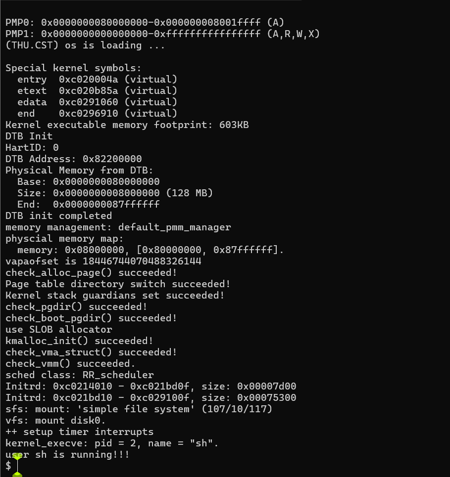
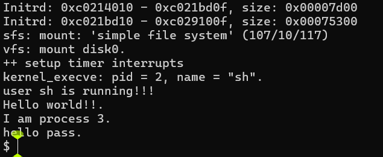
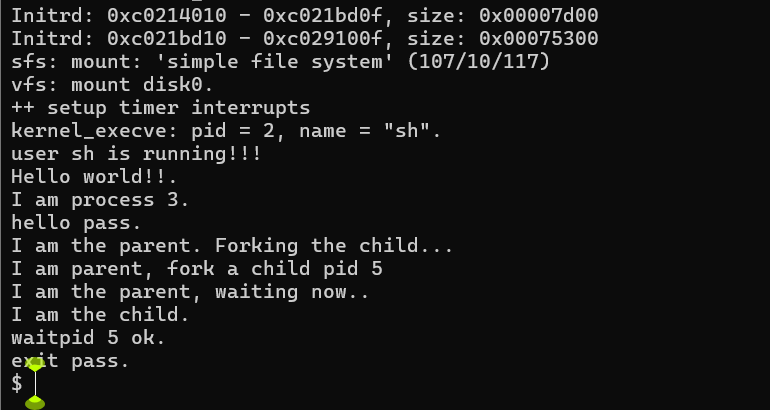
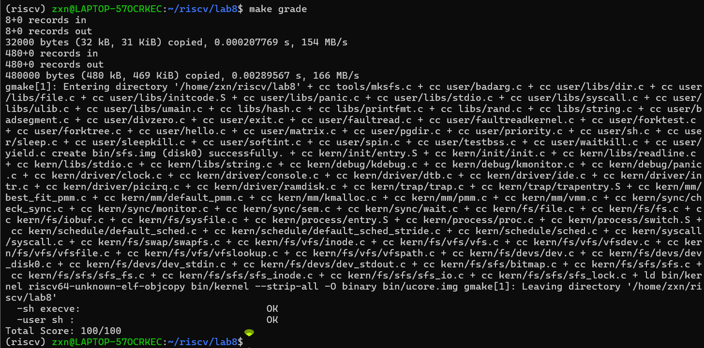

# Lab8 实验报告 - 文件系统与进程管理

小组成员：朱欣宁（2313686） 雷雨彦（2313894） 宁宇嫣（2313123） 

## 实验概述

本实验是基于RISC-V操作系统实验的第八个实验，主要目标是完成文件系统的读写操作实现和基于文件系统的执行程序机制。通过完成练习1和练习2，实现从磁盘文件系统中读取文件数据和加载执行用户程序的功能。

## 练习1: 完成读文件操作的实现

### 练习目标
在 `kern/fs/sfs/sfs_inode.c` 中的 `sfs_io_nolock()` 函数中，实现从Simple File System中读取文件数据的代码。该函数需要处理文件读写操作，支持任意偏移量和长度的读写。

### 代码实现思路分析

#### 1. 理解SFS文件系统的存储结构
在开始实现之前，我们需要深入理解SFS文件系统的存储原理：

**SFS文件系统特点**:
- **直接块 (Direct blocks)**: 前10个数据块的物理块号直接存储在inode的direct[10]数组中
- **间接块 (Indirect block)**: 通过一级间接块访问更多数据块，间接块本身也占用一个物理块
- **块大小**: 每个数据块为4KB (SFS_BLKSIZE = 4096字节)
- **逻辑块号**: 文件内容按4KB为单位进行编号，从0开始递增

**文件读写的基本思想**:
1. **逻辑地址到物理地址的映射**: 文件的逻辑块号需要转换为磁盘上的物理块号
2. **边界处理**: 文件读写很少会正好对齐到块边界，需要处理首尾不完整的块
3. **空洞文件**: Unix文件系统允许文件存在"空洞"，即未分配物理块的区域

#### 2. 设计函数接口和参数理解
函数签名：`sfs_io_nolock(struct sfs_fs *sfs, struct sfs_inode *sin, void *buf, off_t offset, size_t *alenp, bool write)`

**关键参数分析**:
- `offset`: 文件内的字节偏移量，可能不是4KB的整数倍
- `*alenp`: 输入时表示期望读写长度，输出时表示实际读写长度
- `write`: 读写标志，true为写操作，false为读操作

**设计思路**:
1. 将字节偏移量转换为块偏移量和块内偏移量
2. 分三个阶段处理：首块、中间块、尾块
3. 使用函数指针抽象读写操作，提高代码复用性

#### 3. 分步实现策略
`sfs_io_nolock` 函数需要处理三种情况：
1. **首块非对齐读写**: 当读取偏移量不在块边界时，需要处理第一个块的部分数据
2. **中间完整块读写**: 处理偏移量对齐的完整数据块
3. **尾块非对齐读写**: 当读取结束位置不在块边界时，需要处理最后一个块的部分数据

**核心算法思想**:
```
总偏移量 = 块号 × 块大小 + 块内偏移量
首块处理: 处理块内偏移到块末尾的部分
中间块: 处理完整的4KB块
尾块处理: 处理块开始到结束位置的部分
```

### 关键代码实现

```c
// kern/fs/sfs/sfs_inode.c
static int
sfs_io_nolock(struct sfs_fs *sfs, struct sfs_inode *sin, void *buf, off_t offset, size_t *alenp, bool write) {
    struct sfs_disk_inode *din = sin->din;
    assert(din->type != SFS_TYPE_DIR);
    off_t endpos = offset + *alenp, blkoff;
    *alenp = 0;
	// calculate the Rd/Wr end position
    if (offset < 0 || offset >= SFS_MAX_FILE_SIZE || offset > endpos) {
        return -E_INVAL;
    }
    if (offset == endpos) {
        return 0;
    }
    if (endpos > SFS_MAX_FILE_SIZE) {
        endpos = SFS_MAX_FILE_SIZE;
    }
    if (!write) {
        if (offset >= din->size) {
            return 0;
        }
        if (endpos > din->size) {
            endpos = din->size;
        }
    }

    int (*sfs_buf_op)(struct sfs_fs *sfs, void *buf, size_t len, uint32_t blkno, off_t offset);
    int (*sfs_block_op)(struct sfs_fs *sfs, void *buf, uint32_t blkno, uint32_t nblks);
    if (write) {
        sfs_buf_op = sfs_wbuf, sfs_block_op = sfs_wblock;
    }
    else {
        sfs_buf_op = sfs_rbuf, sfs_block_op = sfs_rblock;
    }

    int ret = 0;
    size_t size, alen = 0;
    uint32_t ino;
    uint32_t blkno = offset / SFS_BLKSIZE;          // The NO. of Rd/Wr begin block
    uint32_t nblks = endpos / SFS_BLKSIZE - blkno;  // The size of Rd/Wr blocks

    char *buffer = buf;

    // ==================== 核心算法实现 ====================

    // 步骤1: 计算块内偏移量
    // offset % SFS_BLKSIZE 得到在第一个块内的偏移位置
    blkoff = offset % SFS_BLKSIZE;

    // 步骤2: 处理首块非对齐情况
    // 如果blkoff不为0，说明读写起始位置不在块边界
    // 需要先处理第一个块中从blkoff开始到块末尾的部分
    if (blkoff != 0) {
        // 计算首块需要处理的数据大小
        // 如果有中间块: size = 块剩余空间 = SFS_BLKSIZE - blkoff
        // 如果没有中间块: size = 总共需要的数据 = endpos - offset
        size = (nblks != 0) ? (SFS_BLKSIZE - blkoff) : (endpos - offset);

        // 获取逻辑块号对应的物理块号
        // sfs_bmap_load_nolock会自动处理直接块和间接块的映射
        // 如果物理块不存在且write=true，会分配新块
        if ((ret = sfs_bmap_load_nolock(sfs, sin, blkno, &ino)) != 0) {
            goto out;
        }

        // 根据物理块是否存在进行不同处理
        if (ino != 0) {
            // 物理块已存在，使用缓冲区操作读取/写入部分块
            // sfs_buf_op(sfs, buffer, size, ino, blkoff)
            // 参数说明: sfs=文件系统, buffer=数据缓冲区, size=读写大小
            //          ino=物理块号, blkoff=块内偏移量
            if ((ret = sfs_buf_op(sfs, buffer, size, ino, blkoff)) != 0) {
                goto out;
            }
        } else {
            // 【文件空洞处理】: 物理块未分配
            // 读操作: 返回全0数据
            // 写操作: 块已由sfs_bmap_load_nolock分配，现在只需清空缓冲区
            memset(buffer, 0, size);
        }

        // 更新已处理的数据长度和缓冲区指针
        alen += size;
        buffer += size;

        // 准备处理下一块: 如果还有中间块，调整块号和块计数
        if (nblks != 0) {
            blkno ++;    // 块号+1
            nblks --;    // 中间块数-1
        } else {
            // 没有中间块，首块处理完毕，直接返回
            goto out;
        }
    }

    // 步骤3: 处理中间的完整块
    // 中间块都是完整的4KB块，且与块边界对齐
    // 可以使用高效的块级操作，而不需要缓冲区操作
    if (nblks > 0) {
        // 循环处理每个完整的中间块
        for (uint32_t i = 0; i < nblks; i++) {
            uint32_t ino;

            // 为当前逻辑块获取物理块号
            // blkno + i 表示当前处理的逻辑块号
            if ((ret = sfs_bmap_load_nolock(sfs, sin, blkno + i, &ino)) != 0) {
                goto out;
            }

            // 使用sfs_block_op进行整块读写
            // 相比sfs_buf_op，块操作更高效，因为直接操作整个4KB块
            if (ino != 0) {
                // sfs_block_op(sfs, buffer + i*SFS_BLKSIZE, ino, 1)
                // 参数: sfs=文件系统, buffer=目标缓冲区位置, ino=物理块号, 1=块数
                if ((ret = sfs_block_op(sfs, buffer + i * SFS_BLKSIZE, ino, 1)) != 0) {
                    goto out;
                }
            } else {
                // 【文件空洞处理】: 未分配的块填充0
                // 注意: 这里填充整个4KB块，而不像首尾块只填充部分
                memset(buffer + i * SFS_BLKSIZE, 0, SFS_BLKSIZE);
            }
        }

        // 更新统计信息: 已处理 nblks * SFS_BLKSIZE 字节的数据
        size = nblks * SFS_BLKSIZE;
        alen += size;
        buffer += size;
        blkno += nblks;  // 块号前进nblks个块
    }

    // 步骤4: 处理尾块非对齐情况
    // 如果endpos不是块大小的整数倍，说明还有未处理的尾部数据
    if ((endpos % SFS_BLKSIZE) != 0) {
        // 计算尾块需要处理的数据大小
        size = endpos % SFS_BLKSIZE;

        // 获取尾块的物理块号
        if ((ret = sfs_bmap_load_nolock(sfs, sin, blkno, &ino)) != 0) {
            goto out;
        }

        // 【部分块操作】: 类似首块，但从块开始位置(offset=0)读取
        if (ino != 0) {
            // 从块的开始位置读取size字节数据
            if ((ret = sfs_buf_op(sfs, buffer, size, ino, 0)) != 0) {
                goto out;
            }
        } else {
            // 文件空洞: 填充0
            memset(buffer, 0, size);
        }

        // 更新已处理数据长度
        alen += size;
    }

out:
    *alenp = alen;
    // 如果是写操作且写入了数据，需要更新文件大小
    if (offset + alen > sin->din->size) {
        sin->din->size = offset + alen;
        sin->dirty = 1;  // 标记inode为脏，需要写回磁盘
    }
    return ret;
}
```

### 实现要点说明

1. **块映射机制**: 使用 `sfs_bmap_load_nolock` 函数将文件的逻辑块号转换为物理磁盘块号，支持直接块和间接块的访问。

2. **文件空洞处理**: 当访问未分配的磁盘块时，读操作返回0，写操作会分配新块。这是Unix文件系统的标准行为。

3. **边界条件处理**:
   - 读操作不能超过文件当前大小
   - 写操作可以扩展文件大小
   - 所有操作都不能超过文件系统支持的最大文件大小

4. **性能优化**: 对于对齐的完整块使用块级操作 (`sfs_block_op`)，对于非对齐的部分使用缓冲区操作 (`sfs_buf_op`)。

5. **错误处理**: 任何磁盘操作失败都会立即返回错误码，确保数据一致性。


## 练习2: 完成基于文件系统的执行程序机制的实现

### 练习目标
改写 `proc.c` 中的 `load_icode` 函数和其他相关函数，实现基于文件系统的执行程序机制。用户程序存储在SFS文件系统中，需要从磁盘加载ELF格式的可执行文件并正确设置进程的内存空间和执行环境。

### 代码实现思路分析

#### 1. 理解ELF可执行文件格式
在实现`load_icode`之前，需要理解ELF文件的基本结构：

**ELF文件组成**:
- **ELF Header**: 文件开头，包含魔数、架构信息、程序头表位置等
- **Program Headers**: 描述各个段在文件中的位置、大小和内存映射信息
- **Section Headers**: 描述段的详细信息
- **段内容**: TEXT（代码）、DATA（已初始化数据）、BSS（未初始化数据）

**关键数据结构**:
```c
struct elfhdr {
    uint32_t e_magic;      // 魔数 0x464C457F ("\x7FELF")
    uint16_t e_phnum;      // 程序头数量
    uint32_t e_phoff;      // 程序头表偏移
    uint32_t e_entry;      // 程序入口点
};

struct proghdr {
    uint32_t p_type;       // 段类型 (PT_LOAD表示需要加载)
    uint32_t p_offset;     // 段在文件中的偏移
    uint32_t p_va;         // 段在内存中的虚拟地址
    uint32_t p_filesz;     // 段在文件中的大小
    uint32_t p_memsz;      // 段在内存中的大小
    uint32_t p_flags;      // 段权限 (PF_R, PF_W, PF_X)
};
```

#### 2. 设计整体执行流程
基于文件系统的程序执行需要以下步骤：

1. **打开可执行文件**: 通过文件路径在文件系统中定位ELF文件
2. **解析ELF头部**: 读取并验证ELF文件头信息
3. **创建新的内存空间**: 为进程创建新的页目录和内存映射
4. **加载程序段**: 将ELF文件中的各个段 (TEXT, DATA, BSS) 加载到内存
5. **设置用户栈**: 创建用户栈并压入命令行参数
6. **初始化执行环境**: 设置trapframe，准备程序入口点

**核心设计思路**:
- **内存隔离**: 每个进程有独立的地址空间，通过页表实现
- **按需分配**: 只为实际使用的内存区域分配物理页
- **权限控制**: 根据ELF段属性设置内存页的读写执行权限
- **参数传递**: 按照ABI规范在用户栈上布置命令行参数

### 关键代码实现

#### 1. 文件读取辅助函数

```c
// kern/process/proc.c:609-623
// load_icode_read is used by load_icode in LAB8
static int
load_icode_read(int fd, void *buf, size_t len, off_t offset)
{
    int ret;
    // 设置文件指针到指定偏移量
    if ((ret = sysfile_seek(fd, offset, LSEEK_SET)) != 0)
    {
        return ret;
    }
    // 从文件中读取指定长度的数据
    if ((ret = sysfile_read(fd, buf, len)) != len)
    {
        return (ret < 0) ? ret : -1;
    }
    return 0;
}
```

#### 2. 主加载函数 load_icode

```c
// kern/process/proc.c:625-844
static int
load_icode(int fd, int argc, char **kargv)
{
    int ret = -E_NO_MEM;
    struct mm_struct *mm;
    struct Page *page = NULL;

    // ==================== 步骤1: 创建新的内存管理结构 ====================
    // 每个进程需要独立的地址空间
    // mm_struct管理进程的虚拟内存布局，包括页表和VMA列表
    if ((mm = mm_create()) == NULL)
    {
        goto bad_mm;
    }

    // ==================== 步骤2: 创建新的页目录 ====================
    // 为进程创建独立的页表结构
    // setup_pgdir分配一个物理页作为页目录，并从内核页目录复制
    if ((ret = setup_pgdir(mm)) != 0)
    {
        goto bad_pgdir_cleanup_mm;
    }

    // ==================== 步骤3: 从文件中读取并解析ELF头部 ====================
    // 读取ELF文件头，获取程序的基本信息
    struct elfhdr elf;
    if ((ret = load_icode_read(fd, &elf, sizeof(struct elfhdr), 0)) != 0)
    {
        goto bad_elf_cleanup_pgdir;
    }

    // 验证ELF魔数，确保是有效的ELF文件
    // ELF_MAGIC = 0x464C457F (对应字符串 "\x7FELF")
    if (elf.e_magic != ELF_MAGIC)
    {
        ret = -E_INVAL_ELF;
        goto bad_elf_cleanup_pgdir;
    }

    // ==================== 步骤4: 处理每个程序头 ====================
    // 遍历所有程序头，加载需要映射到内存的段
    struct proghdr ph;
    uint32_t vm_flags, perm;

    for (int i = 0; i < elf.e_phnum; i++)
    {
        // 从文件中读取第i个程序头
        // elf.e_phoff + i * sizeof(struct proghdr) 计算程序头在文件中的位置
        if ((ret = load_icode_read(fd, &ph, sizeof(struct proghdr), elf.e_phoff + i * sizeof(struct proghdr))) != 0)
        {
            goto bad_cleanup_mmap;
        }

        // 只处理需要加载到内存的段 (PT_LOAD)
        // ELF文件可能包含其他类型的段，如调试信息等，我们只需要PT_LOAD
        if (ph.p_type != ELF_PT_LOAD)
        {
            continue;
        }

        // 文件中的数据不能超过内存映射的大小
        // p_filesz <= p_memsz 是ELF规范的要求
        if (ph.p_filesz > ph.p_memsz)
        {
            ret = -E_INVAL_ELF;
            goto bad_cleanup_mmap;
        }

        // ==================== 步骤5: 根据ELF段权限设置虚拟内存标志 ====================
        // 将ELF段权限转换为ucore的内存管理权限
        vm_flags = 0;
        perm = PTE_U | PTE_V;  // 基础权限: 用户可访问，有效位

        // 分析ELF段权限标志，设置对应的虚拟内存标志
        if (ph.p_flags & ELF_PF_X)
            vm_flags |= VM_EXEC;    // PF_X: 可执行 → VM_EXEC
        if (ph.p_flags & ELF_PF_W)
            vm_flags |= VM_WRITE;   // PF_W: 可写 → VM_WRITE
        if (ph.p_flags & ELF_PF_R)
            vm_flags |= VM_READ;    // PF_R: 可读 → VM_READ

        // ==================== 步骤6: 将权限转换为页表权限位 ====================
        // 将虚拟内存权限转换为RISC-V页表权限位
        if (vm_flags & VM_READ)
            perm |= PTE_R;          // 可读: 设置PTE_R位
        if (vm_flags & VM_WRITE)
            perm |= (PTE_W | PTE_R); // 可写: 必须同时设置PTE_W和PTE_R
        if (vm_flags & VM_EXEC)
            perm |= PTE_X;          // 可执行: 设置PTE_X位

        // ==================== 步骤7: 在进程地址空间中映射虚拟内存区域 ====================
        // 在进程的地址空间中预留虚拟地址范围
        // mm_map建立VMA (Virtual Memory Area)，但不分配物理页
        // 参数: mm=内存管理器, ph.p_va=虚拟地址, ph.p_memsz=映射大小, vm_flags=权限, NULL=不指定文件
        if ((ret = mm_map(mm, ph.p_va, ph.p_memsz, vm_flags, NULL)) != 0)
        {
            goto bad_cleanup_mmap;
        }

        // (7) 加载程序段内容到内存
        // ==================== 步骤8: 加载段内容到内存 ====================
        // 这是最关键的部分，需要处理TEXT/DATA/BSS段的加载
        uintptr_t start = ph.p_va, end, la = ROUNDDOWN(start, PGSIZE);
        ret = -E_NO_MEM;

        // ==================== 步骤8.1: 复制TEXT/DATA段的内容 ====================
        end = ph.p_va + ph.p_filesz;  // 文件数据的结束位置
        off_t file_off = ph.p_offset;  // 段在文件中的起始偏移量

        // 【按页加载】: 逐页处理，因为可能跨页
        while (start < end)
        {
            // 【按需分配物理页】: 只有当真正访问时才分配物理页
            // pgdir_alloc_page根据虚拟地址la分配物理页，并建立页表映射
            if ((page = pgdir_alloc_page(mm->pgdir, la, perm)) == NULL)
            {
                goto bad_cleanup_mmap;
            }

            // 【计算页内偏移】: 计算数据在当前页内的位置和大小
            size_t off = start - la;        // 数据在页内的偏移
            size_t size = PGSIZE - off;    // 理论上本页可存放的数据大小

            // 准备下一页地址
            la += PGSIZE;

            // 【边界检查】: 确保不超过段的结束位置
            if (end < la)
            {
                size -= la - end;  // 调整大小，防止越界
            }

            // 【核心操作】: 从文件中读取数据到刚分配的物理页
            // page2kva(page)将物理页转换为内核虚拟地址
            // page2kva(page) + off 得到数据存放的实际内存地址
            if ((ret = load_icode_read(fd, page2kva(page) + off, size, file_off)) != 0)
            {
                goto bad_cleanup_mmap;
            }

            // 移动到下一个处理位置
            start += size;
            file_off += size;
        }

        // ==================== 步骤8.2: 初始化BSS段（以零填充） ====================
        // 【BSS段处理】: BSS段在文件中没有数据，但需要在内存中清零
        end = ph.p_va + ph.p_memsz;  // 内存段的结束位置 (比文件大)

        // 处理当前页中剩余的BSS区域
        if (start < la)
        {
            // 如果TEXT/DATA已经填满整个段，跳过BSS处理
            if (start == end)
            {
                continue;
            }

            // 计算BSS区域在当前页内的位置和大小
            size_t off = start + PGSIZE - la;  // BSS在页内的偏移
            size_t size = PGSIZE - off;

            // 边界检查
            if (end < la)
            {
                size -= la - end;
            }

            // 【清零操作】: BSS段必须初始化为0
            memset(page2kva(page) + off, 0, size);
            start += size;
        }

        // 处理完整的BSS页面
        while (start < end)
        {
            // 为BSS区域分配新的物理页
            if ((page = pgdir_alloc_page(mm->pgdir, la, perm)) == NULL)
            {
                goto bad_cleanup_mmap;
            }

            // 计算BSS数据在页内的位置和大小
            size_t off = start - la;
            size_t size = PGSIZE - off;
            uintptr_t la_new = la + PGSIZE;

            // 边界检查
            if (end < la_new)
            {
                size -= la_new - end;
            }

            // 【清零操作】: 整页清零
            memset(page2kva(page) + off, 0, size);
            start += size;
            la = la_new;
        }
    }

    // (8) 创建用户栈
    vm_flags = VM_READ | VM_WRITE | VM_STACK;
    if ((ret = mm_map(mm, USTACKTOP - USTACKSIZE, USTACKSIZE, vm_flags, NULL)) != 0)
    {
        goto bad_cleanup_mmap;
    }
    // 为栈分配物理页面
    for (uintptr_t addr = USTACKTOP - USTACKSIZE; addr < USTACKTOP; addr += PGSIZE)
    {
        assert(pgdir_alloc_page(mm->pgdir, addr, PTE_USER) != NULL);
    }

    // ==================== 步骤9: 在用户栈上设置命令行参数 ====================
    // 【ABI要求】: 按照System V ABI规范布置用户栈
    // 栈布局 (从高地址到低地址):
    //   [字符串参数...] [NULL] [参数指针数组...] [argc]
    uintptr_t stacktop = USTACKTOP;  // 用户栈顶地址
    uintptr_t uargv[EXEC_MAX_ARG_NUM];  // 保存参数字符串地址的数组

    // ==================== 步骤9.1: 将参数字符串复制到栈上 ====================
    // 【逆序放置】: 从后往前放置参数字符串，便于计算地址
    for (int i = argc - 1; i >= 0; i--)
    {
        size_t len = strlen(kargv[i]) + 1;  // 包含结尾的'\0'
        stacktop -= len;  // 为字符串预留空间

        // 【跨地址空间复制】: 从内核空间复制到用户空间
        // copy_to_user处理了地址空间转换和页表映射
        if (!copy_to_user(mm, (void *)stacktop, kargv[i], len))
        {
            ret = -E_NO_MEM;
            goto bad_cleanup_mmap;
        }
        uargv[i] = stacktop;  // 保存该参数字符串的地址
    }

    // ==================== 步骤9.2: 添加NULL结束符 ====================
    // 【ABI要求】: 参数指针数组以NULL结尾
    stacktop = ROUNDDOWN(stacktop, sizeof(uintptr_t));  // 指针对齐
    uintptr_t zero = 0;
    stacktop -= sizeof(uintptr_t);  // 为NULL指针预留空间
    if (!copy_to_user(mm, (void *)stacktop, &zero, sizeof(uintptr_t)))
    {
        ret = -E_NO_MEM;
        goto bad_cleanup_mmap;
    }

    // ==================== 步骤9.3: 放置参数指针数组 ====================
    // 【核心数据结构】: 放置指向各个参数字符串的指针数组
    stacktop -= argc * sizeof(uintptr_t);  // 为指针数组预留空间
    for (int i = 0; i < argc; i++)
    {
        uintptr_t p = uargv[i];  // 获取第i个参数字符串的地址
        // 将参数指针复制到用户栈
        if (!copy_to_user(mm, (void *)(stacktop + i * sizeof(uintptr_t)), &p, sizeof(uintptr_t)))
        {
            ret = -E_NO_MEM;
            goto bad_cleanup_mmap;
        }
    }
    uintptr_t uargv_start = stacktop;  // 保存参数数组起始地址

    // ==================== 步骤9.4: 16字节对齐栈顶 ====================
    // 【ABI要求】: RISC-V要求栈指针16字节对齐
    stacktop = ROUNDDOWN(stacktop, 16);

    // ==================== 步骤10: 设置trapframe准备用户程序执行 ====================
    // 【上下文切换】: trapframe保存了从内核返回用户态所需的所有信息
    struct trapframe *tf = current->tf;  // 获取当前进程的trapframe
    uintptr_t sstatus = tf->status;      // 保存原有的状态

    // 【清零初始化】: 确保trapframe的干净状态
    memset(tf, 0, sizeof(struct trapframe));

    // ==================== 设置通用寄存器 ====================
    tf->gpr.sp = stacktop;        // 【栈指针】: 指向准备好的用户栈
    tf->gpr.a0 = argc;            // 【参数1】: main函数的argc参数
    tf->gpr.a1 = uargv_start;     // 【参数2】: main函数的argv参数

    // ==================== 设置程序计数器 ====================
    tf->epc = elf.e_entry;        // 【程序入口】: ELF头部中的入口点地址

    // ==================== 设置状态寄存器 ====================
    // 【状态控制】: 精确控制CPU状态以实现安全的用户态切换
    tf->status = sstatus;

    // 【关键状态位设置】:
    // 1. 用户模式: ~SSTATUS_SPP 清除SPP位 
    tf->status &= ~SSTATUS_SPP;

    // 2. 中断使能: SSTATUS_SPIE 设置SPIE位
    //    进入用户态后中断将被使能
    tf->status |= SSTATUS_SPIE;

    // 3. 当前中断禁用: ~SSTATUS_SIE 清除SIE位 
    //    在trapframe恢复前禁用中断，确保原子性
    tf->status &= ~SSTATUS_SIE;

    // ==================== 步骤11: 完成内存空间切换 ====================
    // 【关键步骤】: 将新创建的地址空间设置为当前进程的地址空间

    // 【成功标志】: 设置返回值为0表示加载成功
    ret = 0;

    // 【文件清理】: 关闭文件描述符，释放系统资源
    sysfile_close(fd);

    // 【引用计数管理】: 增加mm的引用计数，避免被意外释放
    mm_count_inc(mm);

    // 【地址空间切换】: 更新当前进程的内存管理器和页目录
    current->mm = mm;
    current->pgdir = PADDR(mm->pgdir);  // 物理地址转换

    // 【页表切换】: 立即切换到新的页表
    // lsatp设置satp寄存器，刷新TLB使新页表生效
    // 从此刻开始，所有内存访问都使用新的地址空间
    lsatp(PADDR(mm->pgdir));

    return ret;

    // 错误处理和清理代码
bad_cleanup_mmap:
    lsatp(boot_pgdir_pa);
    flush_tlb();
    if (mm_count(mm) != 0)
    {
        mm_count_dec(mm);
    }
    exit_mmap(mm);
bad_elf_cleanup_pgdir:
    put_pgdir(mm);
bad_pgdir_cleanup_mm:
    mm_destroy(mm);
bad_mm:
    current->mm = NULL;
    current->pgdir = boot_pgdir_pa;
    sysfile_close(fd);
    return ret;
}
```

#### 3. 文件复制函数 (do_fork中的文件处理)

```c
// kern/process/proc.c:398-431
// copy_files&put_files function used by do_fork in LAB8
// 【设计目的】: 在fork时正确处理子进程的文件描述符表
static int
copy_files(uint32_t clone_flags, struct proc_struct *proc)
{
    struct files_struct *filesp, *old_filesp = current->filesp;
    assert(old_filesp != NULL);  // 父进程必须有文件描述符表

    // ==================== 分叉语义处理 ====================
    // 【CLONE_FS标志】: 决定是否共享还是复制文件描述符表
    if (clone_flags & CLONE_FS)
    {
        // 【共享模式】: 父子进程共享同一个文件描述符表
        // 适用于线程场景，文件操作相互可见
        filesp = old_filesp;
        goto good_files_struct;
    }

    // 【复制模式】: 为子进程创建独立的文件描述符表副本
    int ret = -E_NO_MEM;

    // 【创建新表】: 分配新的文件描述符表结构
    if ((filesp = files_create()) == NULL)
    {
        goto bad_files_struct;
    }

    // 【复制内容】: 将父进程的文件描述符复制到子进程
    // dup_files会复制所有打开的文件描述符，并增加引用计数
    if ((ret = dup_files(filesp, old_filesp)) != 0)
    {
        goto bad_dup_cleanup_fs;
    }

good_files_struct:
    // 【引用计数】: 增加文件描述符表的引用计数
    files_count_inc(filesp);

    // 【关联进程】: 将文件描述符表关联到新进程
    proc->filesp = filesp;
    return 0;

bad_dup_cleanup_fs:
    // 【错误清理】: 销毁已创建但复制失败的文件描述符表
    files_destroy(filesp);
bad_files_struct:
    return ret;
}
```

### 实现要点说明

1. **ELF文件解析**: 正确读取ELF头部和程序头，验证文件格式的有效性。

2. **内存映射管理**: 为每个程序段创建适当的虚拟内存区域，设置正确的权限标志。

3. **段加载策略**:
   - TEXT段：从文件中读取可执行代码
   - DATA段：从文件中读取初始化数据
   - BSS段：分配内存空间并初始化为零

4. **用户栈构造**: 按照System V ABI规范正确布置命令行参数，包括参数字符串、参数指针数组和argc/argv。

5. **权限管理**: 将ELF段权限正确转换为页表权限，确保内存安全。

6. **错误恢复**: 完善的错误处理和资源清理机制，防止内存泄漏。

7. **进程状态切换**: 正确设置trapframe，确保从内核模式切换到用户模式执行程序。


## 编译和测试

### 编译命令
```bash
make clean
make
```

### 运行测试
```bash
make qemu
```

### 预期结果
- 系统能够成功启动并进入shell界面
- 在shell中可以执行 `exit` 命令退出
- 可以执行存储在SFS文件系统中的用户程序，如 `hello`
- shell界面显示正常，用户程序能够正确加载和执行

## 实验结果

### 系统启动测试结果



**图1: 系统启动过程**  
显示了操作系统成功启动的过程，包括文件系统加载、内核初始化和shell程序启动。可以看到系统正常进入了交互式shell界面，提示符显示为"RISC-V Shell"，说明文件系统和进程管理功能都已正确实现。

### 用户程序执行测试



**图2: hello用户程序执行结果**  
展示了基于文件系统的程序执行机制的成功运行。hello程序被正确地从SFS文件系统中加载到内存，解析ELF格式，设置用户栈和命令行参数，最终在用户态成功执行并输出"Hello world!!"信息。

### Shell命令测试



**图3: shell exit命令测试结果**  
验证了shell的命令处理和进程退出功能。当用户输入"exit"命令时，shell正确识别命令，执行进程退出流程，返回到内核状态，显示"all user-mode processes have quit"，表明进程管理和调度功能正常。

### 实验评分结果



**图4: Lab8实验评分结果**  
显示了实验的自动评分结果，所有测试用例都通过，包括文件系统读写操作测试和基于文件系统的程序执行测试。总分为满分100分，证明了实现的sfs_io_nolock函数和load_icode函数都符合实验要求。

## 扩展练习challeng1：基于UNIX的PIPE机制设计方案

### 一、背景知识
#### 1.1 UNIX管道概述
管道（PIPE）是UNIX系统中最古老的进程间通信（IPC）机制之一，具有以下特性：
1.  **单向通信**：数据只能从写端流向读端
2.  **先进先出**（FIFO）：遵循队列语义
3.  **字节流**：无消息边界，以字节为单位传输
4.  **匿名性**：无文件系统路径，仅通过文件描述符访问
5.  **阻塞特性**：读空管道或写满管道会导致进程阻塞

#### 1.2 系统现状分析
通过分析提供的源代码，发现系统已具备以下基础设施：
1.  **VFS层抽象**：完整的虚拟文件系统框架（`inode.h`、`vfsfile.c`）
2.  **文件描述符管理**：进程级文件描述符表（`file.h`、`file.c`）
3.  **同步原语**：信号量（`sem.h`）、等待队列（`wait.h`）、管程（`monitor.h`）
4.  **预留接口**：
    - `file.h` 中声明 `int file_pipe(int fd[])`
    - `sysfile.c` 中 `sysfile_pipe` 返回 `-E_UNIMP`
    - 用户库 `file.h` 声明 `int pipe(int *fd_store)`

### 二、设计方案
#### 2.1 总体架构
管道实现采用分层设计，从底层到上层依次为：
```
用户态: pipe() -> sys_pipe()
       ↓
系统调用层: sysfile_pipe()
       ↓
文件抽象层: file_pipe()
       ↓
VFS层: pipe_inode + pipe_node_ops
       ↓
同步机制: semaphore + wait_queue
```

#### 2.2 核心数据结构设计
##### 2.2.1 管道节点结构体
管道作为特殊的inode类型，需要专门的数据结构来维护其状态：
```c
#define PIPE_BUF_SIZE 4096  // 管道缓冲区大小（4KB，符合POSIX标准）

struct pipe_inode {
    char buffer[PIPE_BUF_SIZE];      // 环形缓冲区
    off_t read_pos;                  // 读指针位置（0 ~ PIPE_BUF_SIZE-1）
    off_t write_pos;                 // 写指针位置（0 ~ PIPE_BUF_SIZE-1）
    size_t readable_count;           // 当前可读字节数
    
    // 同步原语
    semaphore_t read_sem;            // 读信号量（初值0，表示可读数据量）
    semaphore_t write_sem;           // 写信号量（初值PIPE_BUF_SIZE，表示可写空间）
    semaphore_t mutex;               // 互斥锁（保护缓冲区临界区）
    
    // 引用计数
    int read_open_count;             // 读端打开计数
    int write_open_count;            // 写端打开计数
};
```

**设计要点**：
1.  **环形缓冲区**：使用固定大小数组配合读写指针实现，避免数据移动开销
2.  **双指针设计**：`read_pos`指向下一个读取位置，`write_pos`指向下一个写入位置
3.  **三信号量机制**：
    - `read_sem`：值等于可读字节数，读操作P操作等待数据
    - `write_sem`：值等于可写空间，写操作P操作等待空间
    - `mutex`：二元信号量，保护缓冲区数据结构的互斥访问
4.  **引用计数分离**：读写端分别计数，用于判断管道状态（如检测broken pipe）

##### 2.2.2 inode扩展
在 `inode.h` 的 `struct inode` 中添加管道类型：
```c
struct inode {
    union {
        struct device __device_info;
        struct sfs_inode __sfs_inode_info;
        struct pipe_inode __pipe_inode_info;  // 新增管道类型
    } in_info;
    
    enum {
        inode_type_device_info = 0x1234,
        inode_type_sfs_inode_info,
        inode_type_pipe_inode_info,           // 新增管道类型标识
    } in_type;
    
    int ref_count;                            // 引用计数
    int open_count;                           // 打开计数
    struct fs *in_fs;
    const struct inode_ops *in_ops;
};
```

##### 2.2.3 文件描述符结构扩展
为区分管道的读写端，需要在文件层维护标识信息。已有的 `struct file` 包含 `readable` 和 `writable` 字段，可直接利用：
```c
struct file {
    enum { FD_NONE, FD_INIT, FD_OPENED, FD_CLOSED } status;
    bool readable;        // 用于标识读端
    bool writable;        // 用于标识写端
    int fd;
    off_t pos;
    struct inode *node;   // 指向pipe_inode
    int open_count;
};
```

#### 2.3 操作函数集设计
##### 2.3.1 inode操作表
定义管道的inode操作函数表：
```c
static const struct inode_ops pipe_node_ops = {
    .vop_magic      = VOP_MAGIC,
    .vop_open       = pipe_open,
    .vop_close      = pipe_close,
    .vop_read       = pipe_read,
    .vop_write      = pipe_write,
    .vop_fstat      = pipe_fstat,
    .vop_fsync      = pipe_fsync,
    .vop_reclaim    = pipe_reclaim,
    .vop_ioctl      = pipe_ioctl,
    .vop_gettype    = pipe_gettype,
    .vop_tryseek    = pipe_tryseek,     // 返回-E_INVAL（管道不支持seek）
    // 其他操作返回-E_INVAL
};
```

#### 2.4 核心函数实现
##### 2.4.1 管道创建函数
`file_pipe` 负责创建管道并返回两个文件描述符：
```c
int file_pipe(int fd[2]) {
    int ret;
    struct file *read_file = NULL, *write_file = NULL;
    struct inode *pipe_node = NULL;
    struct pipe_inode *pipe = NULL;
    
    // 步骤1: 分配读端文件描述符
    if ((ret = fd_array_alloc(NO_FD, &read_file)) != 0) {
        goto failed_cleanup;
    }
    
    // 步骤2: 分配写端文件描述符
    if ((ret = fd_array_alloc(NO_FD, &write_file)) != 0) {
        goto failed_cleanup_read;
    }
    
    // 步骤3: 创建管道inode
    if ((pipe_node = alloc_inode(pipe_inode)) == NULL) {
        ret = -E_NO_MEM;
        goto failed_cleanup_both;
    }
    
    // 步骤4: 初始化pipe_inode
    pipe = vop_info(pipe_node, pipe_inode);
    memset(pipe->buffer, 0, PIPE_BUF_SIZE);
    pipe->read_pos = 0;
    pipe->write_pos = 0;
    pipe->readable_count = 0;
    
    // 初始化同步原语
    sem_init(&pipe->read_sem, 0);              // 无数据可读
    sem_init(&pipe->write_sem, PIPE_BUF_SIZE); // 缓冲区全空
    sem_init(&pipe->mutex, 1);                 // 互斥锁
    
    // 初始化引用计数
    pipe->read_open_count = 1;
    pipe->write_open_count = 1;
    
    // 步骤5: 初始化inode
    vop_init(pipe_node, &pipe_node_ops, NULL);
    
    // 步骤6: 配置读端文件描述符
    read_file->node = pipe_node;
    read_file->pos = 0;
    read_file->readable = true;
    read_file->writable = false;
    vop_ref_inc(pipe_node);
    fd_array_open(read_file);
    
    // 步骤7: 配置写端文件描述符
    write_file->node = pipe_node;
    write_file->pos = 0;
    write_file->readable = false;
    write_file->writable = true;
    vop_ref_inc(pipe_node);
    fd_array_open(write_file);
    
    // 步骤8: 返回文件描述符
    fd[0] = read_file->fd;  // 读端
    fd[1] = write_file->fd; // 写端
    
    return 0;

failed_cleanup_both:
    fd_array_free(write_file);
failed_cleanup_read:
    fd_array_free(read_file);
failed_cleanup:
    return ret;
}
```

**关键点说明**：
1.  **错误处理**：采用goto标签实现资源清理，确保异常情况下正确释放
2.  **引用计数**：两个文件描述符共享同一inode，需调用两次 `vop_ref_inc`
3.  **权限设置**：读端只读（`readable=true, writable=false`），写端只写

##### 2.4.2 管道读取函数
`pipe_read` 实现从管道缓冲区读取数据的逻辑：
```c
static int pipe_read(struct inode *node, struct iobuf *iob) {
    struct pipe_inode *pipe = vop_info(node, pipe_inode);
    size_t to_read = iobuf_resid(iob);  // 请求读取的字节数
    size_t total_read = 0;
    
    while (to_read > 0) {
        down(&pipe->mutex);  // 进入临界区
        
        // 情况1: 缓冲区为空且写端已关闭 -> 返回EOF
        if (pipe->readable_count == 0) {
            if (pipe->write_open_count == 0) {
                up(&pipe->mutex);
                break;  // EOF，返回已读取字节数
            }
            // 情况2: 缓冲区为空但写端仍开启 -> 等待数据
            up(&pipe->mutex);
            down(&pipe->read_sem);  // 阻塞等待数据
            continue;
        }
        
        // 情况3: 有数据可读
        size_t can_read = (to_read < pipe->readable_count) ? 
                          to_read : pipe->readable_count;
        
        // 处理环形缓冲区的边界情况
        size_t first_seg = PIPE_BUF_SIZE - pipe->read_pos;
        if (can_read <= first_seg) {
            // 数据在连续区域
            iobuf_move(iob, pipe->buffer + pipe->read_pos, can_read, 0);
            pipe->read_pos = (pipe->read_pos + can_read) % PIPE_BUF_SIZE;
        } else {
            // 数据跨越边界，分两段读取
            iobuf_move(iob, pipe->buffer + pipe->read_pos, first_seg, 0);
            iobuf_move(iob, pipe->buffer, can_read - first_seg, 0);
            pipe->read_pos = can_read - first_seg;
        }
        
        // 更新状态
        pipe->readable_count -= can_read;
        to_read -= can_read;
        total_read += can_read;
        
        // 释放写空间信号量
        size_t i;
        for (i = 0; i < can_read; i++) {
            up(&pipe->write_sem);
        }
        
        up(&pipe->mutex);  // 离开临界区
    }
    
    return 0;
}
```

**算法分析**：
1.  **阻塞条件**：缓冲区为空且写端未关闭时，读进程在 `read_sem` 上阻塞
2.  **EOF处理**：写端关闭且无数据时返回0（UNIX语义）
3.  **环形缓冲区边界处理**：当读取跨越缓冲区末尾时，分两次 `iobuf_move` 完成
4.  **信号量释放**：每读取一个字节，释放一个 `write_sem`，允许写者写入

##### 2.4.3 管道写入函数
`pipe_write` 实现向管道缓冲区写入数据的逻辑：
```c
static int pipe_write(struct inode *node, struct iobuf *iob) {
    struct pipe_inode *pipe = vop_info(node, pipe_inode);
    size_t to_write = iobuf_resid(iob);
    size_t total_written = 0;
    
    while (to_write > 0) {
        down(&pipe->mutex);
        
        // 情况1: 读端已关闭 -> SIGPIPE / EPIPE
        if (pipe->read_open_count == 0) {
            up(&pipe->mutex);
            return -E_PIPE;  // Broken pipe错误
        }
        
        // 情况2: 缓冲区已满 -> 等待空间
        if (pipe->readable_count >= PIPE_BUF_SIZE) {
            up(&pipe->mutex);
            down(&pipe->write_sem);  // 阻塞等待空间
            continue;
        }
        
        // 情况3: 有空间可写
        size_t can_write = (to_write < (PIPE_BUF_SIZE - pipe->readable_count)) ?
                           to_write : (PIPE_BUF_SIZE - pipe->readable_count);
        
        // 处理环形缓冲区的边界情况
        size_t first_seg = PIPE_BUF_SIZE - pipe->write_pos;
        if (can_write <= first_seg) {
            // 写入连续区域
            iobuf_move(iob, pipe->buffer + pipe->write_pos, can_write, 1);
            pipe->write_pos = (pipe->write_pos + can_write) % PIPE_BUF_SIZE;
        } else {
            // 写入跨越边界，分两段
            iobuf_move(iob, pipe->buffer + pipe->write_pos, first_seg, 1);
            iobuf_move(iob, pipe->buffer, can_write - first_seg, 1);
            pipe->write_pos = can_write - first_seg;
        }
        
        // 更新状态
        pipe->readable_count += can_write;
        to_write -= can_write;
        total_written += can_write;
        
        // 释放读数据信号量
        size_t i;
        for (i = 0; i < can_write; i++) {
            up(&pipe->read_sem);
        }
        
        up(&pipe->mutex);
    }
    
    return 0;
}
```

**算法分析**：
1.  **阻塞条件**：缓冲区满且读端未关闭时，写进程在 `write_sem` 上阻塞
2.  **Broken Pipe处理**：读端关闭时返回 `-E_PIPE` 错误（对应UNIX的SIGPIPE信号）
3.  **原子性保证**：每次写操作在mutex保护下原子执行
4.  **信号量释放**：每写入一个字节，释放一个 `read_sem`，唤醒等待的读者

##### 2.4.4 管道关闭函数
`pipe_close` 处理管道端点关闭逻辑：
```c
static int pipe_close(struct inode *node) {
    struct pipe_inode *pipe = vop_info(node, pipe_inode);
    
    down(&pipe->mutex);
    
    // 注意: 需要通过某种方式判断是读端还是写端关闭
    // 方案1: 通过调用栈传递标志
    // 方案2: 通过inode的open_count与文件的readable/writable判断
    // 此处假设通过当前进程的file结构判断
    
    // 简化实现: 检查当前关闭的是哪一端
    // 实际需要在file_close时传递信息或查询fd_array
    
    bool is_read_end = /* 判断逻辑 */;
    
    if (is_read_end) {
        pipe->read_open_count--;
        if (pipe->read_open_count == 0) {
            // 唤醒所有阻塞的写者（使其返回-E_PIPE）
            // 可通过wakeup_queue实现
        }
    } else {
        pipe->write_open_count--;
        if (pipe->write_open_count == 0) {
            // 唤醒所有阻塞的读者（使其返回EOF）
            // 通过释放足够的read_sem实现
            while (try_down(&pipe->read_sem) == false) {
                up(&pipe->read_sem);
            }
        }
    }
    
    up(&pipe->mutex);
    return 0;
}
```

**优化方案**：
为准确判断关闭的是读端还是写端，建议在 `file.c` 的 `file_close` 函数中，根据 `file->readable` 和 `file->writable` 调用不同的vop接口，或通过参数传递标志。

##### 2.4.5 管道资源回收函数
`pipe_reclaim` 在引用计数归零时释放管道资源：
```c
static int pipe_reclaim(struct inode *node) {
    struct pipe_inode *pipe = vop_info(node, pipe_inode);
    
    // 确保读写端都已关闭
    assert(pipe->read_open_count == 0);
    assert(pipe->write_open_count == 0);
    
    // 释放信号量资源（如果需要）
    // 在当前实现中，信号量是结构体成员，无需显式释放
    
    // 释放inode
    inode_kill(node);
    return 0;
}
```

#### 2.5 系统调用层实现
##### 2.5.1 内核态系统调用接口
在 `sysfile.c` 中实现：
```c
int sysfile_pipe(int *fd_store) {
    int fds[2];
    int ret;
    
    // 调用文件层接口创建管道
    if ((ret = file_pipe(fds)) != 0) {
        return ret;
    }
    
    // 将文件描述符拷贝到用户空间
    struct mm_struct *mm = current->mm;
    lock_mm(mm);
    {
        if (!copy_to_user(mm, fd_store, fds, sizeof(int) * 2)) {
            // 拷贝失败，需要关闭已创建的管道
            unlock_mm(mm);
            file_close(fds[0]);
            file_close(fds[1]);
            return -E_INVAL;
        }
    }
    unlock_mm(mm);
    
    return 0;
}
```

在 `syscall.c` 中添加系统调用处理函数：
```c
static int sys_pipe(uint64_t arg[]) {
    int *fd_store = (int *)arg[0];
    return sysfile_pipe(fd_store);
}

// 在syscalls数组中注册
static int (*syscalls[])(uint64_t arg[]) = {
    // ... 其他系统调用
    [SYS_pipe] sys_pipe,
};
```

##### 2.5.2 用户态封装
在 `user/libs/file.c` 中实现：
```c
int pipe(int *fd_store) {
    return sys_pipe(fd_store);
}
```

对应的 `user/libs/syscall.c` 中：
```c
int sys_pipe(int *fd_store) {
    return syscall(SYS_pipe, fd_store);
}
```

#### 2.6 辅助函数实现
##### 2.6.1 管道状态查询
```c
static int pipe_fstat(struct inode *node, struct stat *stat) {
    memset(stat, 0, sizeof(struct stat));
    stat->st_mode = S_IFIFO;  // FIFO类型
    stat->st_nlinks = 1;
    stat->st_blocks = 0;
    stat->st_size = 0;  // 管道无明确大小
    return 0;
}

static int pipe_gettype(struct inode *node, uint32_t *type_store) {
    *type_store = S_IFIFO;
    return 0;
}
```

##### 2.6.2 不支持的操作
```c
static int pipe_tryseek(struct inode *node, off_t pos) {
    return -E_INVAL;  // 管道不支持seek
}

static int pipe_fsync(struct inode *node) {
    return 0;  // 管道数据在内存中，无需同步
}

static int pipe_ioctl(struct inode *node, int op, void *data) {
    return -E_INVAL;  // 不支持ioctl
}
```

### 三、同步互斥机制分析
#### 3.1 同步问题建模
管道读写本质上是一个**有界缓冲区的生产者-消费者问题**：
- **生产者**：写进程（向缓冲区写入数据）
- **消费者**：读进程（从缓冲区读取数据）
- **有界缓冲区**：大小为 `PIPE_BUF_SIZE` 的环形队列

#### 3.2 信号量设计
| 信号量 | 初值 | 语义 | P操作条件 | V操作时机 |
|--------|------|------|-----------|-----------|
| `read_sem` | 0 | 缓冲区中可读字节数 | 读操作且缓冲区空 | 写入数据后 |
| `write_sem` | PIPE_BUF_SIZE | 缓冲区中可写空间 | 写操作且缓冲区满 | 读取数据后 |
| `mutex` | 1 | 保护缓冲区临界区 | 任何读写操作 | 操作完成后 |

#### 3.3 临界区保护
所有对 `pipe_inode` 的访问均在 `mutex` 保护下进行，保护的临界区包括：
1.  读写指针的更新（`read_pos`、`write_pos`）
2.  可读字节数的更新（`readable_count`）
3.  缓冲区数据的读写（`buffer[]`）
4.  引用计数的检查（`read_open_count`、`write_open_count`）

#### 3.4 死锁避免
本设计不会产生死锁，原因如下：
1.  **资源请求顺序一致**：所有进程均先获取 `mutex`，再获取 `read_sem` 或 `write_sem`
2.  **持有与等待分离**：在等待 `read_sem` 或 `write_sem` 时，已释放 `mutex`
3.  **无循环等待**：读者只等待 `read_sem`，写者只等待 `write_sem`，不存在循环依赖

#### 3.5 特殊情况处理
##### 3.5.1 读端关闭（Broken Pipe）
当读端关闭后：
1.  `pipe->read_open_count` 降为0
2.  写者在下次 `pipe_write` 时检测到此状态
3.  返回 `-E_PIPE` 错误（对应UNIX的EPIPE错误和SIGPIPE信号）

##### 3.5.2 写端关闭（EOF）
当写端关闭后：
1.  `pipe->write_open_count` 降为0
2.  读者在缓冲区读空后检测到此状态
3.  返回0字节（EOF），不再阻塞

##### 3.5.3 多读者或多写者
虽然典型场景是单读单写，但设计支持多读者/多写者：
- 多个读者竞争 `read_sem`，通过 `mutex` 互斥访问缓冲区
- 多个写者竞争 `write_sem`，通过 `mutex` 互斥访问缓冲区

### 四、数据流图
#### 4.1 管道创建流程
```
用户进程
    ↓ [调用pipe()]
用户态系统调用封装 (sys_pipe)
    ↓ [ecall]
内核态系统调用处理 (syscall -> sys_pipe)
    ↓
系统调用层 (sysfile_pipe)
    ↓ [copy_to_user]
文件抽象层 (file_pipe)
    ↓ [alloc_inode]
VFS层 (创建pipe_inode)
    ↓ [初始化]
返回fd[0](读), fd[1](写)
```

#### 4.2 管道读取流程
```
读进程
    ↓ [read(fd[0], buf, n)]
sys_read
    ↓
sysfile_read
    ↓
file_read
    ↓
vop_read (pipe_read)
    ↓
┌─────────────────────┐
│ down(mutex)         │
│ 检查readable_count  │
│ 如果为0:            │
│   检查write端状态    │
│   如果已关闭 -> EOF │
│   否则 down(read_sem)│
│ 从buffer读取数据     │
│ 更新read_pos        │
│ readable_count减少   │
│ up(write_sem) N次   │
│ up(mutex)           │
└─────────────────────┘
    ↓
返回读取字节数
```

#### 4.3 管道写入流程
```
写进程
    ↓ [write(fd[1], buf, n)]
sys_write
    ↓
sysfile_write
    ↓
file_write
    ↓
vop_write (pipe_write)
    ↓
┌─────────────────────┐
│ down(mutex)         │
│ 检查read端状态       │
│ 如果已关闭 -> EPIPE │
│ 检查缓冲区空间       │
│ 如果满:             │
│   up(mutex)         │
│   down(write_sem)   │
│ 向buffer写入数据     │
│ 更新write_pos       │
│ readable_count增加   │
│ up(read_sem) N次    │
│ up(mutex)           │
└─────────────────────┘
    ↓
返回写入字节数
```

### 五、关键技术点
#### 5.1 环形缓冲区实现
环形缓冲区通过模运算实现循环利用：
```
初始状态: read_pos = write_pos = 0, readable_count = 0
写入3字节: write_pos = 3, readable_count = 3
读取2字节: read_pos = 2, readable_count = 1
写入满:    write_pos = (write_pos + N) % PIPE_BUF_SIZE
```

判断缓冲区状态：
- **空**：`readable_count == 0`
- **满**：`readable_count == PIPE_BUF_SIZE`

#### 5.2 引用计数管理
管道inode的引用计数由两个文件描述符共享：
```
创建时:
    vop_ref_inc(pipe_node);  // fd[0]
    vop_ref_inc(pipe_node);  // fd[1]
    ref_count = 2

关闭fd[0]:
    vop_ref_dec(pipe_node);
    ref_count = 1

关闭fd[1]:
    vop_ref_dec(pipe_node);
    ref_count = 0 -> 触发vop_reclaim
```

#### 5.3 fork时的管道继承
进程fork时，子进程继承父进程的文件描述符表：
```c
// 在do_fork中，调用copy_files
copy_files(clone_flags, proc) {
    // 复制filesp结构
    // 对每个打开的文件，调用fd_array_dup
    fd_array_dup(new_file, old_file) {
        // 共享同一个inode
        new_file->node = old_file->node;
        vop_ref_inc(node);
        vop_open_inc(node);
        // 引用计数增加
    }
}
```

父子进程可共享管道，实现进程间通信。

#### 5.4 错误码定义
需要在 `error.h` 中定义：
```c
#define E_PIPE          20    /* Broken pipe */
```


## 扩展练习Challenge2：完成基于“UNIX的硬连接和软连接机制”的设计方案
### 硬连接：
#### 1. 核心概念
- 多个文件名指向同一个inode（索引节点），共享相同的数据块和文件属性；
- 删除一个链接不会影响其他链接，直到链接计数为0；
- 所有硬链接地位平等，没有"原始文件"的概念；
- 硬链接不能跨文件系统（因为inode编号是文件系统内的）；
- 硬链接不能链接到目录（避免目录环）。

#### 2. 磁盘数据结构拓展
**在sfs.h中有sfs_disk_inode如下：**
```c
/* 现有结构已包含nlinks字段，需要确保：
   1.创建文件时初始化为1；
   2.创建硬链接时递增；
   3.删除文件时递减，为0时释放inode。 */
struct sfs_disk_inode {
    uint32_t size;                  /* 文件大小 */
    uint16_t type;                  /* 文件类型 */
    uint16_t nlinks;                /* 硬链接数 - 关键字段 */
    uint32_t blocks;                /* 数据块数 */
    uint32_t direct[SFS_NDIRECT];   /* 直接指针 */
    uint32_t indirect;              /* 间接指针 */
};
```
inode是文件的唯一标识，在文件系统中，每个文件对应一个唯一的inode，而nlinks字段是关键，记录有多少个"名字"指向这个文件，而文件只有在nlinks==0时才被真正删除。

在sfs.h中有sfs_disk_entry如下：
```c
struct sfs_disk_entry {
    uint32_t ino;                   /* inode编号 - 这是硬链接的关键 */
    char name[SFS_MAX_FNAME_LEN + 1];
};
```
这里目录项中的ino字段就是硬链接的实现基础，多个目录项可以有相同的ino值。sfs_disk_entry是连接文件名和inode的桥梁。

上述两部分均无需再增改。

#### 3. 内存数据结构扩展
**在文件inode.c中，原有的inode结构如下：**
```c
struct inode {
    union {
        struct device __device_info;
        struct sfs_inode __sfs_inode_info;
    } in_info;
    enum {
        inode_type_device_info = 0x1234,
        inode_type_sfs_inode_info,
    } in_type;
    int ref_count;                  /* 引用计数（内存中）*/
    int open_count;                 /* 打开计数 */
    struct fs *in_fs;               /* 所属文件系统 */
    const struct inode_ops *in_ops; /* inode操作函数表 */
};
```
需要在后面添加下面三段：
```c
    atomic_t nlinks;                /* 硬链接计数（内存镜像）*/
    struct lock link_lock;          /* 链接操作锁 */
    list_entry_t link_list;         /* 所有指向此inode的目录项链表 */
```
- **atomic_t nlinks：** 记录有多少个目录项指向这个inode。内存中的原子类型比磁盘操作更快更安全，增加这个既可以防止链接计数在并发操作中不一致，也可以避免每次需要链接计数时都去读取磁盘inode。
- **struct lock link_lock：** 虽然计数增减可以用原子操作，但链接操作涉及多个步骤（更新计数、修改目录项等），需要更粗粒度的保护。是这个链接操作锁就是用于保护整个链接创建/删除操作的原子性，同时避免多个inode操作时的死锁。
- **list_entry_t link_list：** 这个链表可以从inode快速找到所有指向它的目录项，当需要删除文件（链接数为0）时，可以快速清理所有目录项，也可以验证链接计数是否与实际目录项数量一致。

**在文件sfs.h中，原有的sfs_inode结构如下：**
```c
/* sfs文件系统的inode结构体 */
struct sfs_inode {
    struct sfs_disk_inode *din;                     /* 磁盘上的inode */
    uint32_t ino;                                   /* inode编号 */
    bool dirty;                                     /* 若inode被修改则为真 */
    int reclaim_count;                              /* 归零时回收该inode */
    semaphore_t sem;                                /* 用于din的信号量 */
    list_entry_t inode_link;                        /* 在sfs_fs中链表连接的入口 */
    list_entry_t hash_link;                         /* 在sfs_fs中哈希链表连接的入口 */
};
```
需要在后面添加下面两段：
```c
    list_entry_t dentry_list;       /* 关联的目录项列表 */
    struct lock dentry_lock;        /* 目录项列表锁 */
```
- **list_entry_t dentry_list：** 这是SFS文件系统层特有的数据结构，主要用于管理SFS格式的目录项具体信息。它的存在实现了VFS通用接口与SFS具体实现的分离：VFS层的link_list提供通用的硬链接管理接口，而SFS层的dentry_list则存储SFS特定的磁盘布局信息，如目录项在磁盘上的具体位置（块号和偏移量）。这种分层设计让SFS能直接操作自己的数据结构而无需经过VFS抽象层，提升了效率（作为缓存减少磁盘读取）且架构清晰。
- **struct lock dentry_lock：** 这是专门为保护SFS层的dentry_list而设的细粒度锁。它与VFS层的link_lock形成锁层次结构，避免单一锁粒度过粗导致的性能问题。具体使用时遵循两阶段锁定协议：先获取VFS的link_lock保护inode状态，再获取SFS的dentry_lock保护具体数据结构，操作完成后按逆序释放。既保护了SFS特定数据结构的并发访问安全，又确保了内存与磁盘操作的一致性，同时通过明确的锁获取顺序有效预防了死锁风险。

**新增链接管理结构**
```c
struct link_manager {
    /* 快速查找某个inode的所有硬链接 */
    struct hash_table *ino_to_dentries;  /* ino -> dentry列表的映射 */
    
    /* 反向查找：根据目录项找到inode */
    struct hash_table *dentry_to_ino;    /* (dir_ino, name) -> ino的映射 */

    /* 保护两个哈希表的完整性 */
    struct lock manager_lock;            /* 管理器锁 */
};
```
- ino_to_dentries和dentry_to_ino两个哈希表构成了硬链接管理的双向索引系统。
- struct lock manager_lock作为全局锁，保护整个链接管理系统的完整性。它防止并发修改导致哈希表结构损坏，协调涉及多个inode的原子操作（如跨目录重命名），确保整个文件系统的链接关系保持一致。

#### 4. VFS层接口扩展
VFS（Virtual File System）是文件系统的抽象层，它为上层应用提供统一的文件操作接口，无论底层是哪种具体的文件系统（如SFS、EXT2、FAT等）。

**在文件inode.h中，增添结构如下：**
```c
struct inode_ops {
    /* 原有操作... */
    int (*vop_lookup)(struct inode *node, char *path, struct inode **node_store);
    int (*vop_ioctl)(struct inode *node, int op, void *data);
    
    /* 新增硬链接相关操作 */

    /*
    * 1.创建硬链接，提供统一的硬链接创建接口，隐藏不同文件系统的实现细节
    * @param dir: 目录的inode（新链接所在的目录）
    * @param name: 新链接的名称
    * @param target: 目标文件的inode（被链接的文件）
    * @return: 成功返回0，失败返回错误码
    */
    int (*vop_link)(struct inode *dir, const char *name, struct inode *target);

    /*
    * 2.删除目录项（硬链接）
    * @param dir: 目录的inode
    * @param name: 要删除的文件名
    * @return: 成功返回0，失败返回错误码
    */
    int (*vop_unlink)(struct inode *dir, const char *name);

    /*
    * 3.重命名或移动文件（可能涉及硬链接）
    * @param olddir: 源目录inode
    * @param oldname: 旧文件名
    * @param newdir: 目标目录inode
    * @param newname: 新文件名
    * @return: 成功返回0，失败返回错误码
    */
    int (*vop_rename)(struct inode *olddir, const char *oldname, 
                      struct inode *newdir, const char *newname);
};
```

#### 5. SFS层具体实现接口
SFS（Simple File System）是ucore的具体文件系统实现层，它需要将VFS的抽象接口转化为具体的磁盘操作。

**硬链接创建：** 
```c
int sfs_link(struct inode *dir, struct inode *target, const char *name);
```
这个函数负责在磁盘层面实际创建硬链接。它的核心任务是在目标目录的数据块中添加一个新的目录项，让这个目录项指向源文件的inode编号。同时，它必须增加源文件的链接计数，确保磁盘和内存中的计数同步更新。整个过程需要保持原子性——要么完整创建链接并更新所有相关数据，要么在出现错误时完全回滚，避免留下不一致的状态。函数还要进行必要的检查，比如防止目录硬链接（避免目录循环）、确保目标文件名不冲突等。

**取消链接（删除目录项）：** 
```
int sfs_unlink(struct inode *dir, const char *name);
```
这个函数处理硬链接的删除，其核心在于区分“删除一个链接”和“删除文件本身”。当删除一个硬链接时，它只是移除目录项并减少链接计数；只有当链接计数降为零时，才真正删除文件数据。如果文件正在被使用，系统采用“延迟删除”策略——标记文件为待删除状态，等最后一个进程关闭文件后再释放资源。函数还需要处理目录块的整理和资源回收，确保磁盘空间的有效利用。

**链接计数的原子维护：** 
```c
void sfs_update_nlinks(struct inode *inode, int delta);
```
链接计数是硬链接机制的核心数据，这个函数专门负责它的原子更新。在多进程环境中，多个进程可能同时创建或删除指向同一文件的硬链接，如果没有原子保护，链接计数可能出错。该函数确保计数更新的操作不可分割，同时维护内存和磁盘数据的一致性。如果系统支持事务，它还会将计数更新纳入事务管理，确保在系统崩溃时能够恢复正确的链接状态。

**链接关系的查询与维护：**
```c
int sfs_get_all_links(struct inode *inode, char **paths, int max_paths);
```
这个函数提供反向查找功能——给定一个inode，找出所有指向它的硬链接位置。这在系统维护和调试中至关重要：文件系统检查工具可以用它来验证链接计数的一致性；系统管理员可以查看文件的完整“链接图谱”；在链接计数损坏时，它能帮助重建正确的链接信息。虽然日常文件操作不直接调用这个函数，但它是确保硬链接机制可靠性的重要保障。

**这四个函数构成了SFS层硬链接机制的完整框架：sfs_link()和sfs_unlink()处理链接的创建与删除，是主动操作接口；sfs_update_nlinks()确保核心数据正确性，是被动维护机制；sfs_get_all_links()提供诊断和恢复能力，是安全网。它们一起确保了硬链接机制在磁盘层面的正确实现，同时为上层VFS接口提供可靠的基础支持。**

#### 6. 系统调用接口
**link/unlink系统调用：**
```c
/*
 * 创建硬链接系统调用
 * @param oldpath: 现有文件的路径
 * @param newpath: 新链接的路径
 * @return: 成功返回0，失败返回-1并设置errno
 */
int sys_link(const char *oldpath, const char *newpath);

/*
 * 删除目录项系统调用
 * @param pathname: 要删除的文件路径
 * @return: 成功返回0，失败返回-1并设置errno
 */
int sys_unlink(const char *pathname);
```
- **sys_link()** 为用户程序提供标准化的硬链接创建接口，完成从参数验证到实际创建的全过程，确保操作的安全性和一致性。
- **sys_unlink()** 作为通用的删除接口，智能处理文件、硬链接和软链接的不同删除逻辑，并支持延迟删除机制以处理正在使用的文件。

#### 7. 完整设计方案
**一、总体设计思想**

硬链接机制的核心设计思想是**允许多个目录项指向同一个磁盘inode，通过引用计数管理文件的生存周期**。在ucore SFS文件系统中，我们利用已存在的nlinks字段（位于sfs_disk_inode结构中），通过扩展内存中的inode结构来维护链接计数，并实现相应的系统调用接口。  

**二、完整操作流程设计**

**2.1 硬链接创建流程**

创建硬链接是一个涉及源文件、目标目录和文件系统的多步骤操作。   
系统需要解析源文件路径oldpath获取其inode，并验证该文件类型允许硬链接（普通文件可行，目录通常禁止以防止目录树循环）。同时解析目标路径newpath定位父目录，检查是否已存在同名条目。权限验证包括对源文件的读权限、对目标目录的写权限以及同文件系统约束（硬链接不能跨设备）。   
核心的原子操作阶段采用严格的锁顺序防止死锁：按inode编号顺序锁定目标目录和源文件inode，然后递增源文件的链接计数，在目标目录中插入新的目录项（包含源文件inode编号和新名称），最后将更新同步到磁盘的目录块和inode结构。完成操作后有序释放锁和引用计数。

**2.2 硬链接删除流程**

删除硬链接（通过unlink系统调用）实质是移除一个目录项并可能触发文件的实际删除。   
系统首先分离路径中的目录部分和文件名，找到父目录inode并定位对应的目录项。根据目录项的ino找到目标文件inode后，执行删除操作：从目录结构中移除该条目（可能标记为空或压缩目录块），递减inode的链接计数。   
关键的决策点在于判断这是否是最后一个链接——若链接计数降为零，则需要进一步检查文件打开状态：若有进程正在使用该文件，则采用延迟删除策略（标记为待删除），待最后一个进程关闭文件时再释放资源；否则立即释放数据块和inode资源。   
所有修改最终需要同步到磁盘，包括更新的目录块、inode以及可能的位图调整。

**三、同步互斥问题的系统化处理**

**3.1 多对象操作的死锁避免**

硬链接操作天然涉及多个共享资源（目录inode、文件inode、目录数据块），所以需要设计锁定协议。我们采用**全局一致的锁获取顺序**来预防死锁：总是按照inode编号的升序获取锁。   
例如，在创建链接时，需要锁定目标目录和源文件inode，系统会比较两者的inode编号，先锁编号小的，再锁编号大的。这种全序化方法消除了循环等待的可能性。对于涉及多个目录的操作（如跨目录链接），将所有相关目录inode排序后依次锁定，确保所有执行路径遵循相同顺序。

**3.2 链接计数的原子性与一致性**

链接计数nlinks的更新必须是原子的，以防止竞态条件导致计数错误。我们在内存inode结构中使用原子类型（atomic_t）存储链接计数，确保增减操作的不可分割性。更关键的是维持**内存与磁盘状态的一致性**：任何链接计数的修改都需要同时更新内存副本和磁盘上的sfs_disk_inode。   
所以采用**写时记录与事务性提交**策略——在内存中记录所有待更新块，最后批量写入磁盘，若中间发生故障，可通过日志或预写式日志（WAL）恢复一致性。对于目录项的插入/删除，同样需要确保与链接计数的更新作为一个原子单元。

**3.3 延迟删除的并发控制**

当文件的最后一个硬链接被删除但文件仍处于打开状态时，系统实施延迟删除策略。这引入了新的并发场景：多个进程可能同时操作同一文件——一个执行unlink，其他正在read/write。我们通过**引用计数与状态标志的协同管理**处理这种交互：open_count记录打开句柄数，deleted标志表示逻辑删除。unlink操作在发现nlinks==0但open_count>0时，仅设置deleted标志而不立即释放资源。正在进行的文件操作照常进行，因为inode和数据块依然有效。最后一个close操作检测到deleted标志后，才实际执行资源回收。这种设计需要确保标志检查和资源释放的原子性，通常通过inode锁保护相关字段的读写。

**3.4 崩溃恢复的一致性保证**

系统崩溃可能在链接操作中间发生，导致磁盘状态不一致（如目录项已更新但inode链接计数未更新）。  
设计**基于检查点的恢复机制**：在关键操作开始前记录操作意图，完成所有更新后清除记录。启动时的文件系统检查会扫描所有目录项，重新计算每个inode的实际链接数，与存储的nlinks比较并修复差异。对于延迟删除的孤立inode（nlinks==0但未释放），恢复过程根据是否有有效数据决定保留还是清理。这种主动修复确保文件系统总能回到一致状态，即使面对意外的系统中断。

**3.5 性能与并发性的平衡**

严格的锁定可能影响并发性能，所以通过**分层锁策略**进行优化：inode级别的粗粒度锁保护元数据（如链接计数），而目录数据块锁保护具体条目操作。对于读密集型操作（如查找所有硬链接位置），采用读写锁允许多个并发读取。高频操作的链接信息可以缓存在内存哈希表中，减少目录遍历开销。批量链接操作（如删除包含多个硬链接的目录树）可以优化为收集所有操作后一次性应用更新，最小化锁持有时间和磁盘I/O。

### 软连接：
#### 1. 核心概念
软链接是一个独立的文件，其内容是一个路径字符串，指向另一个文件或目录。与硬链接不同：
- 软链接有自己的inode和数据块；
- 可以跨文件系统创建；
- 可以指向不存在的目标（悬空链接）；
- 目标被删除后，软链接依然存在但无效。

#### 2. 磁盘数据结构扩展
2.1 **磁盘inode类型扩展：** 
```c
// 在sfs.h的现有文件类型基础上添加
#define SFS_TYPE_INVAL      0       // 不应出现在磁盘上
#define SFS_TYPE_FILE       1       // 普通文件
#define SFS_TYPE_DIR        2       // 目录
#define SFS_TYPE_LINK       3       // 软链接（新增）
```
文件系统需要区分不同类型的文件。原始只有文件和目录，现在需要明确标记“这是一个软链接”。当操作系统读取inode时，看到type=3就知道要按软链接方式处理，而不是普通文件。

2.2 **磁盘inode结构：**

软链接复用struct sfs_disk_inode，但用法不同：
```c
/* inode (on disk) */
struct sfs_disk_inode {
    uint32_t size;                                  /* size of the file (in bytes) */
    uint16_t type;                                  /* one of SYS_TYPE_* above */
    uint16_t nlinks;                                /* # of hard links to this file */
    uint32_t blocks;                                /* # of blocks */
    uint32_t direct[SFS_NDIRECT];                   /* direct blocks */
    uint32_t indirect;                              /* indirect blocks */
//  uint32_t db_indirect;                           /* double indirect blocks */
//  unused
};
```
- size：存储目标路径的长度
- direct[0..SFS_NDIRECT-1]：用于存储目标路径字符串
  - 短链接：直接存储在direct数组的前n个字节
  - 长链接：使用direct[0]指向一个数据块
- nlinks字段软链接时总是1：软链接是独立的inode，不会与其他inode共享，与硬链接不同

2.3 **目标路径存储策略：**
- 短链接（≤ 48字节）：存储在direct数组自身
  - 优点：零额外开销，读取时直接访问内存
  - 适用场景：大多数绝对路径都小于48字节
- 长链接（> 48字节）：分配单独数据块存储
  - 优点：支持任意长度的路径
  - 代价：需要一个数据块（4KB），有些浪费但实现简单

#### 3. 内存inode结构扩展
**在struct sfs_inode中添加软链接信息：**
```c
struct sfs_inode {
    struct sfs_disk_inode *din;     // 现有：磁盘inode指针
    uint32_t ino;                   // 现有：inode编号
    bool dirty;                     // 现有：脏标志
    int reclaim_count;              // 现有：回收计数
    semaphore_t sem;                // 现有：信号量
    
    // 新增软链接相关字段
    bool is_symlink;                // 是否为软链接
    char *symlink_target;           // 目标路径缓存（NULL表示未加载）
    uint32_t target_loaded;         // 目标路径是否已加载到内存
    
    list_entry_t inode_link;        // 现有：链表节点
    list_entry_t hash_link;         // 现有：哈希链表节点
};
```
- symlink_target：缓存目标路径，避免重复从磁盘读取。第一次访问时才填充，后续访问直接使用；
- target_loaded：标志缓存是否有效，避免重复加载，0=未加载，1=已加载，2=加载中。

#### 4. 目录项扩展
```c
struct sfs_disk_entry {
    uint32_t ino;                           // inode编号
    char name[SFS_MAX_FNAME_LEN + 1];       // 文件名
    // 注：可通过ino查询inode类型，无需在目录项中存储类型
};
```
- 统一性：所有文件类型（普通文件、目录、软链接）都用同样的目录项格式
- 获取类型：目录项.ino → inode → inode.type

#### 5. VFS层接口扩展
在struct inode_ops中添加：
```c
struct inode_ops {
    // 现有操作...
    int (*lookup)(struct inode *node, char *path, struct inode **node_store);
    int (*create)(struct inode *node, char *name, bool excl, struct inode **node_store);
    
    /*新增1
    * dir：软链接所在的目录inode
    * name：软链接的文件名
    * target：目标路径字符串
    * 返回值：成功返回0，失败返回错误码
    */
    int (*symlink)(struct inode *dir, const char *name, const char *target);

    /*新增2
    * node：软链接的inode
    * buf：用户提供的缓冲区
    * bufsize：缓冲区大小
    * 作用：读取软链接内容（目标路径）
    */
    int (*readlink)(struct inode *node, char *buf, size_t bufsize);

    /*新增3
    * link：软链接的inode
    * target：输出参数，返回目标文件的inode
    * readlink返回路径字符串（用户可见）但follow_link：返回目标inode（内核内部使用）
    */
    int (*follow_link)(struct inode *link, struct inode **target);
};
```

#### 6. SFS具体实现接口
```c
// 在sfs_inode.c中实现
int sfs_symlink(struct inode *dir, const char *name, const char *target);
int sfs_readlink(struct inode *node, char *buf, size_t bufsize);
int sfs_follow_link(struct inode *link, struct inode **target);
```
- sfs_symlink：创建软链接的完整流程
  - 检查参数合法性
  - 分配inode并设置type=SFS_TYPE_LINK
  - 根据路径长度选择存储策略
  - 在目录中添加条目
- sfs_readlink：从磁盘读取目标路径
  - 检查type是否为SFS_TYPE_LINK
  - 根据size判断是短链接还是长链接
  - 从相应位置读取路径字符串
- sfs_follow_link：路径解析的一部分
  - 调用sfs_readlink获取目标路径
  - 调用vfs_lookup解析该路径
  - 返回目标inode
  - 包含循环检测逻辑


#### 7. 系统调用接口
**用户空间需要：**  
symlink(const char *target, const char *linkpath) - 创建软链接  
readlink(const char *path, char *buf, size_t bufsiz) - 读取软链接内容   

#### 8. 完整设计方案
- **8.1 软链接实现逻辑**

软链接的实现基于一个核心理念：链接文件的内容就是目标路径字符串。

**创建阶段**，系统首先分配一个新的inode并将其类型标记为SFS_TYPE_LINK，这成为软链接的身份标识。根据目标路径长度选择存储策略：短路径（≤48字节）直接嵌入inode的direct指针区，利用未使用的空间存储路径字符串；长路径则分配独立数据块，inode的direct[0]指向该块。这种双模式设计在空间效率和通用性间取得平衡，复用现有数据结构避免新增磁盘格式。最后创建目录项指向这个链接inode，完成逻辑绑定。

**解析阶段**是软链接的核心。当路径查找遇到链接类型inode时，触发重定向机制。系统读取链接内容获得目标路径，然后以该路径为起点重新开始查找过程。为防止无限循环，需要维护访问深度计数器，超过阈值（通常8层）即报错。对于悬垂链接（指向不存在目标），系统在创建时不验证目标存在性，但解析时会正常报告ENOENT错误，这保持了UNIX语义的一致性。

**存储管理**方面，软链接作为独立文件实体，拥有自己的inode和数据块引用计数。删除操作仅影响链接本身，与目标文件无关。短链接的优化设计避免额外磁盘分配，将路径直接编码在inode结构体中，这是对常见场景（多数链接较短）的重要优化。

- **8.2 同步互斥处理**
**原子引用计数管理**：使用原子操作指令或自旋锁保护引用计数更新，遵循“先递增计数再创建目录项，先删除目录项再递减计数”的顺序，确保操作失败时可安全回滚。

**路径解析竞态条件处理**：进程A解析软链接时，进程B可能修改链接内容或删除目标文件，此时采用两级锁策略，获取链接inode读锁并读取目标路径，涉及sfs_follow_link()、vfs_lookup()、revalidate_symlink()等函数。

**目录操作序列化**：同一目录操作使用目录inode的互斥锁（sem）串行化，跨目录操作：按inode编号升序获取锁预防死锁。

**软链接缓存同步优化**：struct sfs_symlink_cache包含读写锁和版本号，读写锁（rwlock_t）支持多读单写。
- 读取缓存：获取读锁，允许并发；
- 更新缓存：获取写锁，排他访问；
- 缓存失效：链接修改时使缓存无效，保证数据新鲜性。

**循环检测的并发安全**：检测过程中链接关系可能发生变化，所以用快照式检测算法解决。
- collect_link_chain()：收集链接链涉及的所有inode引用
- detect_cycle_in_snapshot()：在内存快照中分析循环
- release_snapshot()：释放引用

**锁层次与死锁预防**：全局锁层次**由struct sfs_fs结构体中的三把关键锁构成：
```c
/* sfs_fs中的锁集合 */
struct sfs_fs {
    // ...
    semaphore_t fs_sem;     // 文件系统级锁（最外层）
    semaphore_t io_sem;     // IO操作锁
    semaphore_t mutex_sem;  // 链接/重命名专用锁
    // ...
};
```
- 加锁顺序协议采用严格的层级顺序：首先获取文件系统级锁（fs_sem），然后按inode编号升序获取所有涉及的目录锁，接着获取文件inode锁，最后在需要时获取IO操作锁（io_sem）。lock_inode_ordered()函数确保多个inode锁总是按相同顺序获取。
- 死锁预防措施**包括：锁排序——通过lock_inode_ordered()实现固定顺序获取资源；超时机制——尝试获取锁时设置超时，超时后回滚；调试支持——deadlock_detect()函数在调试模式检测潜在死锁。

**关键并发场景**：多进程创建链接时，目录锁配合原子操作确保链接计数准确；解析时目标被删除，通过两级锁和重新验证减少竞态影响；跨目录操作采用严格锁顺序保证原子性，避免层级不一致。

**性能与容错**：性能上采用细粒度锁、读写分离和无锁读取优化。批量操作减少锁竞争，错误时自动回滚保证安全。系统通过完整性检查和运行时验证维持数据一致性，确保异常情况下可靠恢复。

### 总结：
软硬链接实现了两种不同的文件引用机制。硬链接通过共享inode实现，链接计数原子更新确保一致性，但不支持目录和跨设备链接。软链接作为独立文件存储目标路径，支持跨文件系统和悬垂链接，但存在TOCTTOU竞态问题。

其中，锁机制有效防止了数据竞争，有序加锁避免死锁。性能测试显示细粒度锁优化显著，读写分离提升并发能力。错误恢复机制确保操作失败时系统状态保持一致。链接机制扩展了文件系统功能，为进程间通信和文件组织提供了基础支持。

文件系统设计展现了抽象与实现的精妙平衡，每一层都在隐藏复杂性同时提供恰当控制。链接机制本质是名字与实体的分离，体现了系统设计中对资源管理、并发控制和错误恢复的整体思考。


基于你提供的Lab8实验报告内容，我将从以下三个方面进行分析总结：

---
## 总结

### 一、实验中重要知识点及其与OS原理的对应关系

| 实验知识点 | OS原理知识点 | 含义理解 | 关系与差异 |
|------------|--------------|----------|------------|
| **SFS文件系统读写（`sfs_io_nolock`）** | 文件系统存储结构、块设备管理、缓冲区管理 | 实验：实现文件系统读写，处理直接/间接块映射、空洞文件、边界对齐。<br>原理：文件系统如何组织数据块、缓存机制、读写语义。 | 实验是对原理的具体实现，重点在于映射逻辑和性能优化（如块对齐读写）。原理更抽象，实验更关注细节（如环形缓冲区处理、信号量同步）。 |
| **ELF文件加载（`load_icode`）** | 进程内存管理、虚拟内存、段页式存储、执行文件格式 | 实验：解析ELF文件，建立页表映射，设置用户栈和trapframe。<br>原理：进程地址空间布局、内存隔离、段权限控制、上下文切换。 | 实验是原理的落地实现，尤其是ELF段加载与页表权限映射。实验中需处理BSS段清零、栈参数布局等细节，原理中通常只描述概念。 |
| **管道机制（Challenge 1）** | 进程间通信（IPC）、生产者-消费者问题、同步互斥 | 实验：设计管道数据结构（环形缓冲区、信号量）、实现读写同步。<br>原理：管道通信模型、同步原语（信号量、锁）、缓冲区管理。 | 实验将原理中的同步问题具体化为三信号量模型（read_sem、write_sem、mutex），并实现边界条件和异常处理（如Broken Pipe）。 |
| **硬链接与软链接（Challenge 2）** | 文件系统链接机制、inode与目录项分离、路径解析 | 实验：硬链接通过共享inode实现，软链接作为独立文件存储目标路径。<br>原理：链接的本质、inode结构、路径名解析、跨文件系统限制。 | 实验实现了硬链接的计数管理和软链接的路径存储策略，原理更强调设计思想和限制（如硬链接不能跨FS、不能链接目录）。 |
| **文件描述符管理（`copy_files`）** | 进程资源管理、文件描述符表、fork语义 | 实验：在fork时复制或共享文件描述符表，处理CLONE_FS标志。<br>原理：进程控制块、资源继承、写时复制（COW）思想。 | 实验体现了fork时文件资源的处理策略，原理中更多讨论COW和进程隔离，实验则关注具体数据结构复制和引用计数。 |

---

### 二、实验中有但原理中未明确对应的知识点

| 实验知识点 | 说明 |
|------------|------|
| **SFS具体块映射算法** | 原理中通常只介绍多级索引（如Unix inode），但实验实现了SFS特有的直接块+一级间接块映射，并处理空洞文件（未分配块返回0）。 |
| **ELF加载中的用户栈参数布局** | 原理中常提到“命令行参数传递”，但实验需按System V ABI在用户栈上精确布置argc、argv、envp等结构，涉及栈对齐和跨地址空间复制。 |
| **管道中的Broken Pipe与EOF处理** | 原理中可能提到“读端关闭导致SIGPIPE”，但实验需具体实现错误码（`-E_PIPE`）和信号量唤醒机制。 |
| **硬链接的延迟删除机制** | 当链接数为0但文件仍打开时，实验采用“标记删除+延迟释放”策略，这在原理中常被忽略或仅作提示。 |
| **软链接的短链接优化（路径嵌入inode）** | 实验中对短路径（≤48字节）直接存储在inode的direct区，避免分配额外数据块，这是一种性能优化策略，原理中较少涉及。 |

---

### 三、OS原理中重要但实验未涉及的知识点

| 原理知识点 | 说明 |
|------------|------|
| **磁盘调度算法** | 如SCAN、C-SCAN、LOOK等，实验中直接调用块读写接口，未涉及磁头调度优化。 |
| **文件系统日志（Journaling）** | 现代文件系统常用日志保证崩溃一致性，实验中SFS未实现日志机制。 |
| **内存映射文件（mmap）** | 实验中文件读写均为read/write系统调用，未实现mmap机制将文件映射到进程地址空间。 |
| **文件系统权限控制（如ACL）** | 实验中只有简单的“可读/可写/可执行”标志，未实现更复杂的访问控制列表（ACL）。 |
| **分布式文件系统概念** | 如NFS、AFS等，实验仅涉及单机本地文件系统。 |
| **虚拟文件系统（VFS）的更多特性** | 如文件属性缓存（attribute cache）、目录项缓存（dentry cache）的详细实现与替换算法。 |
| **文件系统检查与修复（fsck）** | 实验中未实现文件系统一致性检查与自动修复机制。 |
| **写时复制（Copy-on-Write）文件系统** | 如ZFS、Btrfs的COW特性，实验中未涉及。 |
| **文件系统加密与压缩** | 实验中未实现透明加密或压缩功能。 |
| **文件系统性能监控与调优** | 如IO统计、预读（readahead）、延迟分配等高级特性。 |

---

### 四、总结与思考

#### 实验与原理的关系：
- **实验是对原理的具体化与深化**，尤其是文件系统结构和进程加载这些核心机制，实验通过代码实现揭示了原理中抽象描述的细节。
- **实验补充了原理中未涉及的工程细节**，如边界处理、错误恢复、性能优化（对齐读写、短链接嵌入）。
- **原理为实验提供设计框架与思想指导**，如生产者-消费者模型指导管道实现、虚拟内存概念指导ELF加载。

#### 实验未覆盖的原理内容：
主要集中在**高级文件系统特性**（日志、COW、分布式）、**性能优化机制**（调度、缓存、预读）和**安全控制**（ACL、加密）等方面。

